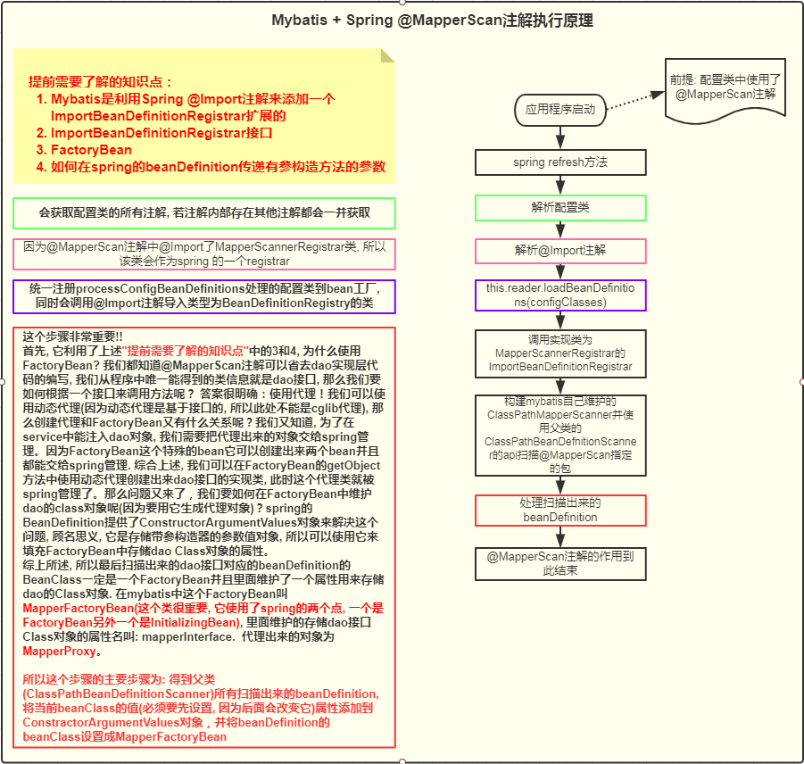
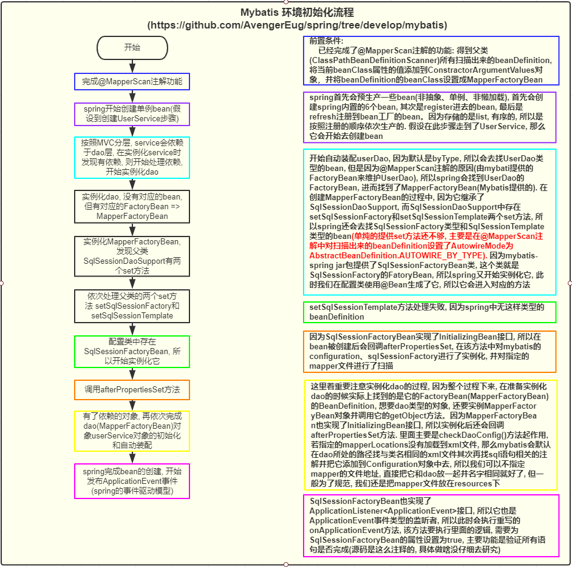

## 一、一级缓存

  * 首先mybatis的一级缓存是基于`sqlSession`的，也就是说同一个`sqlSession`的查询，若使用的同一个sql语句，那么后面的执行将会从缓存中获取，若执行了`update`, `insert`, `delete`操作，则缓存会被清除，[参考MyBatis中文官网-一级缓存](http://www.mybatis.cn/archives/744.html)。**但是集成了spring后，mybatis的一级缓存就失效了**

### 1.1 集成spring中一级缓存为什么会失效

* Spring和MyBatis整合时，每次查询之后都要进行关闭sqlsession，关闭之后数据被清空。所以MyBatis和Spring整合之后，一级缓存是没有意义的。具体表现在`mybatis-spring` jar包的`SqlSessionTemplate`的内部类`SqlSessionInterceptor`中。具体参考如下代码:

  ```java
  private class SqlSessionInterceptor implements InvocationHandler {
      @Override
      public Object invoke(Object proxy, Method method, Object[] args) throws Throwable {
          SqlSession sqlSession = getSqlSession(
              SqlSessionTemplate.this.sqlSessionFactory,
              SqlSessionTemplate.this.executorType,
              SqlSessionTemplate.this.exceptionTranslator);
          try {
              Object result = method.invoke(sqlSession, args);
              if (!isSqlSessionTransactional(sqlSession, SqlSessionTemplate.this.sqlSessionFactory)) {
                  // force commit even on non-dirty sessions because some databases require
                  // a commit/rollback before calling close()
                  sqlSession.commit(true);
              }
              return result;
          } catch (Throwable t) {
              Throwable unwrapped = unwrapThrowable(t);
              if (SqlSessionTemplate.this.exceptionTranslator != null && unwrapped instanceof PersistenceException) {
                  // release the connection to avoid a deadlock if the translator is no loaded. See issue #22
                  closeSqlSession(sqlSession, SqlSessionTemplate.this.sqlSessionFactory);
                  sqlSession = null;
                  Throwable translated = SqlSessionTemplate.this.exceptionTranslator.translateExceptionIfPossible((PersistenceException) unwrapped);
                  if (translated != null) {
                      unwrapped = translated;
                  }
              }
              throw unwrapped;
          } finally {
              if (sqlSession != null) {
                  closeSqlSession(sqlSession, SqlSessionTemplate.this.sqlSessionFactory);
              }
          }
      }
  }
  ```

  

  

### 1.2 一级缓存技术底层原理

* 内部是使用HashMap的数据结构来实现的。

## 二、二级缓存

* [参考Mybatis中文官网-二级缓存](http://www.mybatis.cn/archives/746.html)

  * 开启二级缓存: 在对应的mapper中添加 <cache /> 标签
  * 二级缓存是基于命名空间而言的, 若其他的命名空间对表中的数据进行了修改, 当前命名空间的缓存并不会更新, 
    它只会更新对应命名空间的缓存, 所以会出现数据不一致的问题。 原因就是: 多个命名空间操作更新同一个表,
    只有做更新操作的命名空间对应的缓存会及时更新。
    
    所以, 如果有多个命名空间会对同一张表做操作, 那么建议别选mybatis的二级缓存, 可以使用第三方的eg: redis
    
## 三、mybatis中添加mapper的几种方式
  1. class
     org.apache.ibatis.session.Configuration.addMapper(Class<T> type)
  2. package
     org.apache.ibatis.session.Configuration.addMappers(String packageName)
  3. url
  4. path

## 四、mybatis原理执行流程图

### 4.1 @MapperScan注解执行流程



### 4.2 mybatis环境初始化流程



## 五、mybatis使用的是采用构造方法来实现对MapperFactoryBean的自动装配的
```java
    Constructor<?>[] ctors = determineConstructorsFromBeanPostProcessors(beanClass, beanName);
    if (ctors != null ||
            mbd.getResolvedAutowireMode() == RootBeanDefinition.AUTOWIRE_CONSTRUCTOR ||
            mbd.hasConstructorArgumentValues() || !ObjectUtils.isEmpty(args))  {
        return autowireConstructor(beanName, mbd, ctors, args);
    }
```

* 具体在于上述一段代码, 第一行是获取到@Autowired注解的构造方法, 很显然, 
  MapperFactoryBean中没有构造方法添加了@Autowired注解，因此第一行代码没什么作用。
  主要是后面代码的作用：`mbd.hasConstructorArgumentValues()`, mybatis针对每个
  MapperFactoryBean都添加了一个构造方法会用上的值(dao层接口的class字符串)
  , 源码为如下
    ```java
      definition.getConstructorArgumentValues().addGenericArgumentValue(definition.getBeanClassName()); // issue #59
    ```
  这行代码的主要作用就是告诉spring使用带参的构造方法初始化bean

## 六、spring事务管理流程
  * @Transactional注解可以添加在类中也可以添加在方法中, 若添加在类中则对类中的所有方法
    都添加事务管理,
  * 要想添加事务需要做如下步骤:
     1. 开启事务管理, 在一个bean中添加@EnableTransactionManagement注解表示开启事务管理
     2. 添加一个事务管理器(也能自己自定义一个事务逻辑, 可以参考MyTransactionManager类)， 如下
        @Bean
        public PlatformTransactionManager platformTransactionManager() {
            DataSourceTransactionManager manager = new DataSourceTransactionManager();
            manager.setDataSource(dataSource());
            return manager;
        }
     3. 设置事务回滚的类名, 这里设置了是抛出了exception类型的异常就回滚

