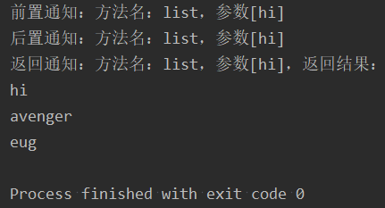
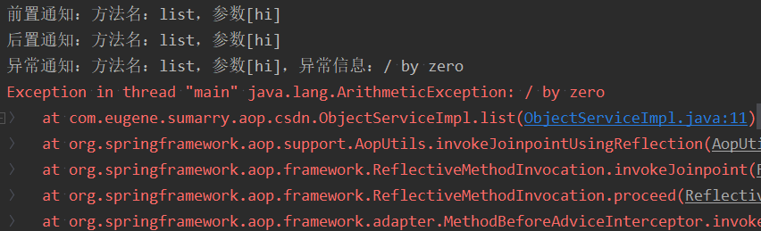
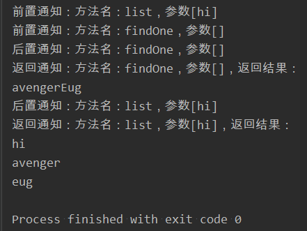
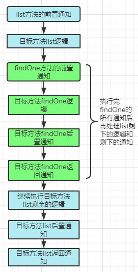
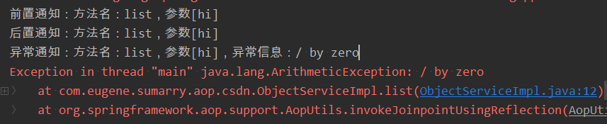
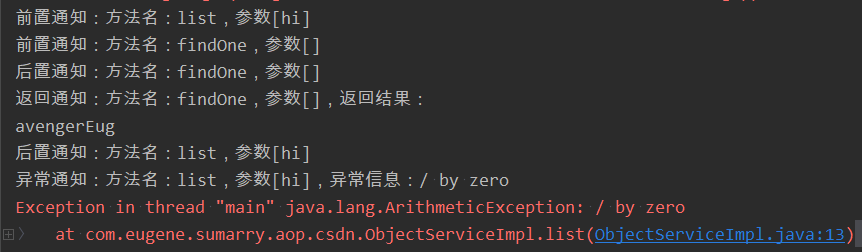
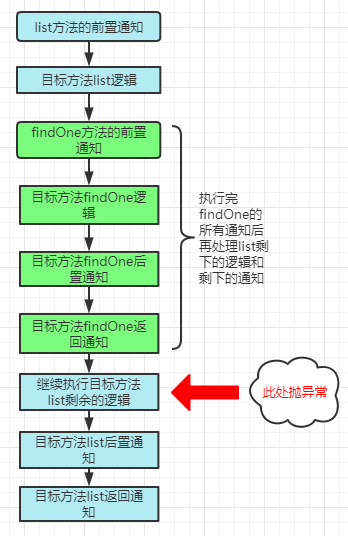
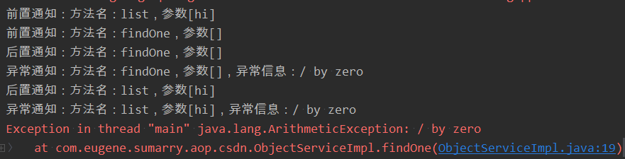

# Spring AOP使用篇：熟悉使用前置通知、后置通知、返回通知、异常通知，并了解其特性

## 前言

* 本次将会总结5篇关于spring aop的知识点，主要包含：**AOP使用篇、AOP原理篇、事务使用篇、事务原理篇、事务同步器使用篇**

* **AOP原理篇分为两个主题：**

  ```shell
  1、源码中是如何将我们定义的各种通知与目标方法绑定起来的
  2、我们的aop代理对象的执行顺序是怎样的
  ```

* **事务原理篇主要是以一个事务传播机制的案例来讲解spring事务在底层的执行过程**
* 本次总结的核心为：如何使用**Spring AOP，以及了解相关通知的特性**（相关的概念在这就不再累述了，大家可以参考其他文章），废话不多说，我们直接开始吧！

## 一、测试案例

### 1.1 预览测试案例项目结构

* 项目启动入口类Entry.java：

  ```java
  public class Entry {
      public static void main(String[] args) {
          AnnotationConfigApplicationContext context = new AnnotationConfigApplicationContext(AppConfig.class);
          ObjectService objectService = context.getBean(ObjectService.class);
          objectService.list("hi");
      }
  
      // 配置扫描类，启动了aop功能
      @Configuration
      @ComponentScan("com.eugene.sumarry.aop.csdn")
      @EnableAspectJAutoProxy(proxyTargetClass = false, exposeProxy = true)
      public static class AppConfig {
      }
  
      // 被这个注解标识的方法会被增强
      @Retention(RetentionPolicy.RUNTIME)
      @Target(ElementType.METHOD)
      public @interface AspectAnnotation {
      }
  }
  ```

* 接口类ObjectService.java

  ```java
  public interface ObjectService {
  
      String[] list(String str);
  
      String findOne();
  }
  ```

* 接口实现类ObjectServiceImpl.java

  ```java
  @Service
  public class ObjectServiceImpl implements ObjectService {
  
      @Entry.AspectAnnotation
      @Override
      public String[] list(String str) {
          return new String[] {str, "avenger", "eug"};
      }
  
      @Override
      public String findOne() {
          return "avengerEug";
      }
  }
  ```

* 定义切面AspectDefinition.java

  ```java
  @Aspect
  @Component
  public class AspectDefinition {
  
      /**
       * 指定包含@AspectAnnotation注解的方法才会被增强
       */
      @Pointcut("@annotation(com.eugene.sumarry.aop.csdn.Entry.AspectAnnotation)")
      public void pointcutAnnotation() {
      }
  
      /**
       * 前置通知：执行目标方法前 触发
       */
      @Before(value = "pointcutAnnotation()")
      public void methodBefore(JoinPoint joinPoint) {
          String methodName = joinPoint.getSignature().getName();
          System.out.println("前置通知：方法名：" + methodName + "，参数" + Arrays.asList(joinPoint.getArgs()));
      }
  
      /**
       * 后置通知：执行目标方法后触发
       */
      @After(value = "pointcutAnnotation()")
      public void methodAfter(JoinPoint joinPoint) {
          String methodName = joinPoint.getSignature().getName();
          System.out.println("后置通知：方法名：" + methodName + "，参数" + Arrays.asList(joinPoint.getArgs()));
      }
  
      /**
       * 返回通知：目标方法执行完并返回参数后触发。
       */
      @AfterReturning(value = "pointcutAnnotation()", returning = "result")
      public void methodAfterReturning(JoinPoint joinPoint, Object result) {
          String methodName = joinPoint.getSignature().getName();
          System.out.println("返回通知：方法名：" + methodName + "，" +
                  "参数" + Arrays.asList(joinPoint.getArgs()) + "，" +
                  "返回结果：");
          if (result instanceof String[]) {
              Arrays.stream((String[]) result).forEach(System.out::println);
          } else {
              System.out.println(result);
          }
      }
  
      /**
       * 异常通知：目标方法抛出异常后触发
       */
      @AfterThrowing(value = "pointcutAnnotation()", throwing="ex")
      public void methodExceptionOccurred(JoinPoint joinPoint, Exception ex) {
          String methodName = joinPoint.getSignature().getName();
          System.out.println("异常通知：方法名：" + methodName + "，参数" + Arrays.asList(joinPoint.getArgs()) + "，异常信息：" + ex.getMessage());
      }
  
  }
  ```

### 1.2 测试案例项目结构分析

* 整个项目结构采用**java config**的方法来启动spring，在**AppConfig**类中，定义了spring项目的核心功能：

  > 1、@Configuration注解标识AppConfig是一个配置类
  >
  > 2、@ComponentScan指定了spring扫描的包路径为：**com.eugene.sumarry.aop.csdn**，这将说明在此包下的所有spring识别的注解都会被解析
  >
  > 3、@EnableAspectJAutoProxy注解表示导入了spring aop相关的组件，代表着aop功能启动了。其中，proxyTargetClass属性指定了aop使用哪种代理方式来增强目标类，其规则如下所示：
  >
  > | proxyTargetClass | 含义                                                         |      |
  > | ---------------- | ------------------------------------------------------------ | ---- |
  > | 默认为false      | 使用的是jdk动态代理，最终代理对象和目标对象会实现同一个接口  |      |
  > | 设置为true       | 看目标类的结构，如果目标类是一个接口，这里采用的还是jdk动态代理。否则使用cglib代理。**后续将在`AOP原理篇`中证明** |      |
  >
  > 而**将exposeProxy设置为true，则表示spring会将代理对象暴露到线程变量ThreadLocal中**，具体有哪些场景，可以接着往下看。

  而在切面定义类**AspectDefinition**中，我们定义了一个切面，而切的点就是：如果spring中的bean中有方法被**@AspectAnnotation**注解标识了，那么这个bean的对应方法将会被增强，并且增强的逻辑包含：**前置通知、后置通知、返回通知、异常通知**这四个部分，这里使用通知来描述可能不太形象，大家可以把它理解成4个钩子函数，其对应钩子函数的触发时机及特色如下表所示（也可以参考AspectDefinition类中的定义）：

  | 通知类型（钩子函数） | 触发时机                                         | 特色                                             |
  | -------------------- | ------------------------------------------------ | ------------------------------------------------ |
  | 前置通知             | 调用目标方法前触发                               | 只要程序没有严重问题并且定义了前置通知必定会触发 |
  | 后置通知             | 目标方法逻辑执行完毕后触发，或目标方法内部抛异常 | 只要程序没有严重问题并且定义了后置通知必定会触发 |
  | 返回通知             | 当目标方法的返回值返回后触发                     | 与**异常通知**互斥，一山不容二虎                 |
  | 异常通知             | 当目标方法执行过程中发生异常时触发               | 与**返回通知**互斥，一山不容二虎                 |

  根据上述的介绍，我们很容易能够发现，针对于ObjectServiceImpl类而言，list方法被增强了，findOne方法没有被增强。这代表着，当执行list方法时，会触发**前置通知、后置通知、返回通知** 或者 **前置通知、后置通知、异常通知**。 关于异常通知和返回通知互斥的原因，会在后续的`AOP原理篇`中证明。

### 1.3 测试list方法的三种调用情况（无抛异常）

#### 1.3.1 目标对象的list方法内部无异常抛出

* 直接运行Entry.java类的main方法，得到如下结果

  

* 目标方法list无异常往外抛时，只触发**前置通知、后置通知、返回通知**，符合上述分析的第一种情况。

#### 1.3.2 目标对象的list方法内部抛出异常

* 将list方法改成一下，改成如下模样：

  ```java
  @Entry.AspectAnnotation
  @Override
  public String[] list(String str) {
      int x = 1 / 0;
      return new String[] {str, "avenger", "eug"};
  }
  ```

* 直接运行Entry.java类的main方法，得到如下结果

  

* 目标方法list有异常往外抛时，只触发**前置通知、后置通知、异常通知**，符合上述分析的第二种情况。使用程序也证明了**返回通知和异常通知**是互斥的，不能同时存在。（**后续会在`AOP原理篇`中证明**）

#### 1.3.3 在目标对象的list方法中调用另一个被增强的方法

* 改造下上面的ObjectServiceImpl.java类，将findOne方法也添加上`@Entry.AspectAnnotation`注解，改造后的结构如下所示：

  ```java
  @Service
  public class ObjectServiceImpl implements ObjectService {
  
      @Entry.AspectAnnotation
      @Override
      public String[] list(String str) {
  	    // 要在此处调用具有增强功能的findOne方法，如何做？
          return new String[] {str, "avenger", "eug"};
      }
  
      // 此处添加@Entry.AspectAnnotation注解
      @Entry.AspectAnnotation
      @Override
      public String findOne() {
          return "avengerEug";
      }
  }
  ```

* 如上述的注释：**要在list方法中调用具有增强功能的findOne方法，如何做？**直接使用`this.findOne`可行吗？这里可以明确的告知：使用**this.findOne**的方式肯定无法调用到具有增强功能的findOne方法。这涉及到aop失效的一些场景，要想了解这些场景，得了解aop的实现原理。这里后续再单独写篇文章进行说明。那么有哪些方式来实现这个需求呢？

##### 方式1：自己依赖注入自己

* 如下代码所示：

  ```java
  @Service
  public class ObjectServiceImpl implements ObjectService {
  
      // 自己依赖注入自己，此时注入的是一个代理对象
      @Autowired
      ObjectService objectService;
  
      @Entry.AspectAnnotation
      @Override
      public String[] list(String str) {
          objectService.findOne();
          return new String[] {str, "avenger", "eug"};
      }
  
      @Entry.AspectAnnotation
      @Override
      public String findOne() {
          return "avengerEug";
      }
  }
  ```

##### 方式2：使用spring上下文重新获取bean

* 如下代码所示：

  ```java
  @Service
  public class ObjectServiceImpl implements ObjectService, ApplicationContextAware {
  
      // 使用spring上下文。或者网上有许多的SpringContextUtils工具类，可以使用它们，但原理都一样，都实现了ApplicationContextAware接口
      ApplicationContext applicationContext;
  
      @Override
      public void setApplicationContext(ApplicationContext applicationContext) throws BeansException {
          this.applicationContext = applicationContext;
      }
  
      @Entry.AspectAnnotation
      @Override
      public String[] list(String str) {
          applicationContext.getBean(ObjectService.class).findOne();
          return new String[] {str, "avenger", "eug"};
      }
  
      @Entry.AspectAnnotation
      @Override
      public String findOne() {
          return "avengerEug";
      }
  }
  ```

##### 方式3：利用@EnableAspectJAutoProxy注解的exposeProxy属性

* 上面有介绍到exposeProxy属性，将exposeProxy设置为true的话，spring会将代理对象暴露到线程变量中。因此，在exposeProxy设置为true的情况下，继续修改ObjectServiceImpl类来实现增强方法list内部调用增强方法findOne的需求

* 其代码修改如下所示：

  ```java
  @Service
  public class ObjectServiceImpl implements ObjectService {
  
      @Entry.AspectAnnotation
      @Override
      public String[] list(String str) {
          ((ObjectService) AopContext.currentProxy()).findOne();
          return new String[] {str, "avenger", "eug"};
      }
  
      @Entry.AspectAnnotation
      @Override
      public String findOne() {
          return "avengerEug";
      }
  }
  ```

  使用**AopContext.currentProxy()** api来获取spring 暴露在线程变量中的代理对象。由于代理对象是存在于线程变量中的，即ThreadLocal中，因此，我们需要保证整个调用链不会切换线程，否则将无法获取到spring暴露出来的代理对象。

不管是上面的哪种方式，最终的执行结果都是这样的：



在触发list方法的前置通知后，就执行到了findOne方法，这也间接表明了，前置通知是执行目标方法之前触发的，因为findOne是在目标方法list内部执行的，因此目标方法list的逻辑并还没有执行完毕，要等到findOne方法的逻辑执行完毕后才会触发list方法的后置通知、返回通知或异常通知。其调用流程如下图所示：



### 1.4 基于1.3.3的方式3，测试list方法抛异常的几种情况

#### 1.4.1 在调用findOne方法之前抛异常

* 改造ObjectServiceImpl.java类：

  ```java
  @Service
  public class ObjectServiceImpl implements ObjectService {
  
      @Entry.AspectAnnotation
      @Override
      public String[] list(String str) {
          // 此处抛异常，还没调用到findOne方法
          int x = 1 / 0;
          ((ObjectService) AopContext.currentProxy()).findOne();
          return new String[] {str, "avenger", "eug"};
      }
  
      @Entry.AspectAnnotation
      @Override
      public String findOne() {
          return "avengerEug";
      }
  }
  ```

* 其运行结果为：

  

  很明显：由上结论可以得知，在调用findOne方法之前抛异常，仅仅是影响到了list方法而已。这也比较好理解，因为我还没有调用到findOne方法，当然不会影响到findOne方法。

#### 1.4.2 在调用findOne方法之后抛出异常

* 改造ObjectServiceImpl.java类：

  ```java
  @Service
  public class ObjectServiceImpl implements ObjectService {
  
      @Entry.AspectAnnotation
      @Override
      public String[] list(String str) {
          ((ObjectService) AopContext.currentProxy()).findOne();
          // 调用findOne方法之后抛异常
          int x = 1 / 0;
          return new String[] {str, "avenger", "eug"};
      }
  
      @Entry.AspectAnnotation
      @Override
      public String findOne() {
          return "avengerEug";
      }
  }
  ```

* 其执行结果如下所示：

  

  很明显，我们在findOne方法执行之后抛异常也没有影响到findOne方法的执行，拿我们之前画的流程图来说明：

  

  如图所示，**`在继续执行目标方法list剩余的逻辑`**节点处抛了异常，也就是上述的`int x = 1 / 0;`这段代码，它仅仅影响到的只是list方法的逻辑，不会再影响到findOne方法，因为findOne方法的增强逻辑都已经执行完毕了。

* 说句额外话：如果有对Spring事务的**REQUIRES_NEW**传播机制比较了解的话，应该也会出现这种情况。假设我们的list是默认传播机制**REQUIRED**，而findOne是**REQUIRES_NEW**传播机制。那么在这种情况下，findOne的事务会被提交，而list的事务会被回滚。其原理和上述的分析一致，就是因为findOne是**REQUIRES_NEW**传播机制，它会额外创建一个新的事务，在findOne事务提交后继续执行list剩余逻辑时抛异常，这时，findOne的事务已经提交了，当然不会影响到findOne，所以此时仅仅影响到的是list方法。

#### 1.4.3 在调用findOne方法时，在findOne方法内部抛出异常

* 改造ObjectServiceImpl.java类：

  ```java
  @Service
  public class ObjectServiceImpl implements ObjectService {
  
      @Entry.AspectAnnotation
      @Override
      public String[] list(String str) {
          ((ObjectService) AopContext.currentProxy()).findOne();
          return new String[] {str, "avenger", "eug"};
      }
  
      @Entry.AspectAnnotation
      @Override
      public String findOne() {
          // 此处抛异常
          int x = 1 / 0;
          return "avengerEug";
      }
  }
  ```

* 其运行结果如下所示：

  

  根据结果可知：它影响到了list和findOne方法，也就是说在findOne方法内部抛出的异常，会影响整个调用链上的方法，进而都触发了list和findOne的异常通知。不知道看到这里的小伙伴们心里有没有一点感觉：**这非常像责任链的执行过程，如果我们没有对每一个链上的节点做额外的异常捕捉的话，只要有一个链抛出了异常，就会把异常一层一层的向上抛。** 非常幸运的是，在Spring的AOP的调用过程使用的就是责任链的设计模式。我们将在下一篇**AOP原理篇**来进行说明。

* 说句额外话：如果有对Spring事务的**REQUIRED**传播机制比较了解的话，应该也会出现内部方法抛异常最终会将整个调用链给回滚的情况。这种情况和我们现在测试的这种用例的原理是一致的，因为两个方法使用的是同一个事务，最终异常会向上一层一层的抛，当事务管理器感知到由异常发生时，事务管理器就会做回滚操作。

## 二、总结

* 通过本次的学习，咱们了解了**前置通知、后置通知、返回通知、异常通知**实际上就是一个钩子函数的回调，而针对于`返回通知和异常通知互斥`以及`Spring如何确定使用哪种代理方式来生成代理对象`的疑问，我将在后续的**AOP原理篇**证明。
* 在1.3和1.4章节中，针对aop的各种调用情况、抛异常情况都做了测试，还额外提了一嘴关于事务相关的知识点，如果这块不太明白的话，后续会在**事务原理篇**详细解释。
* **如果你觉得我的文章有用的话，欢迎点赞、收藏和关注。:laughing:**
* **I'm a slow walker, but I never walk backwards**