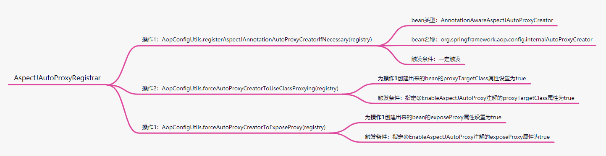
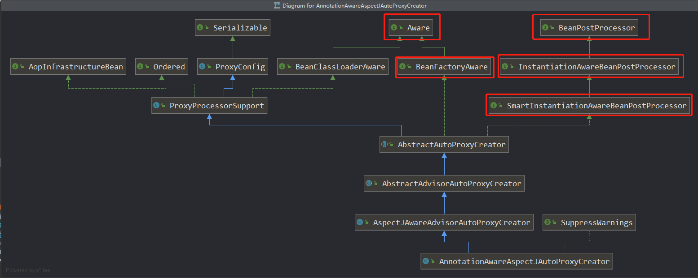
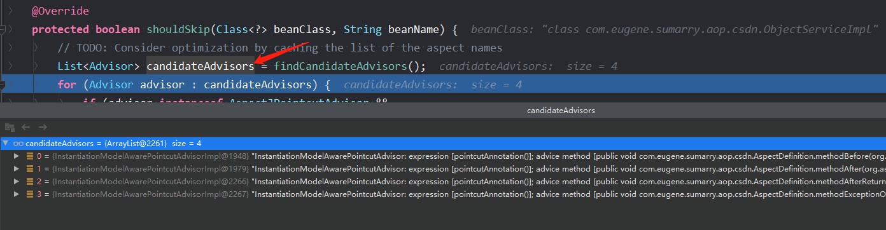
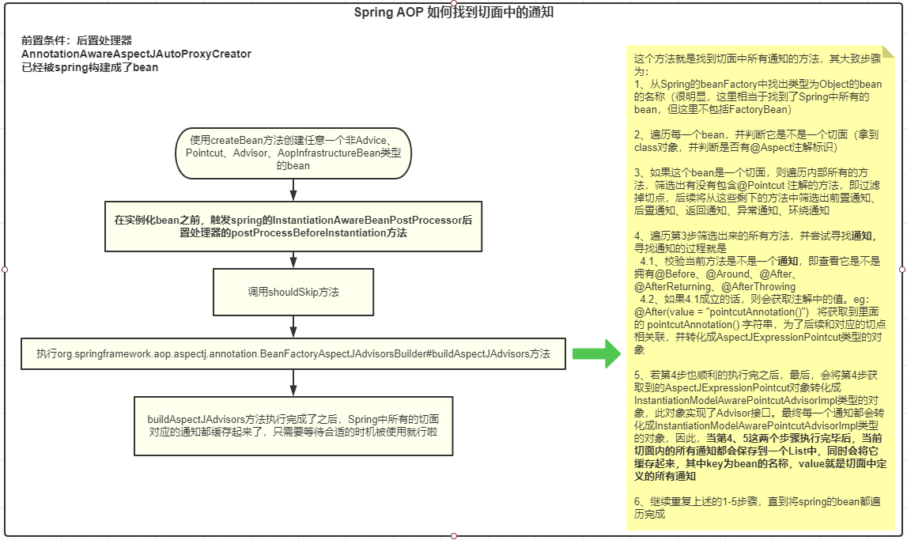
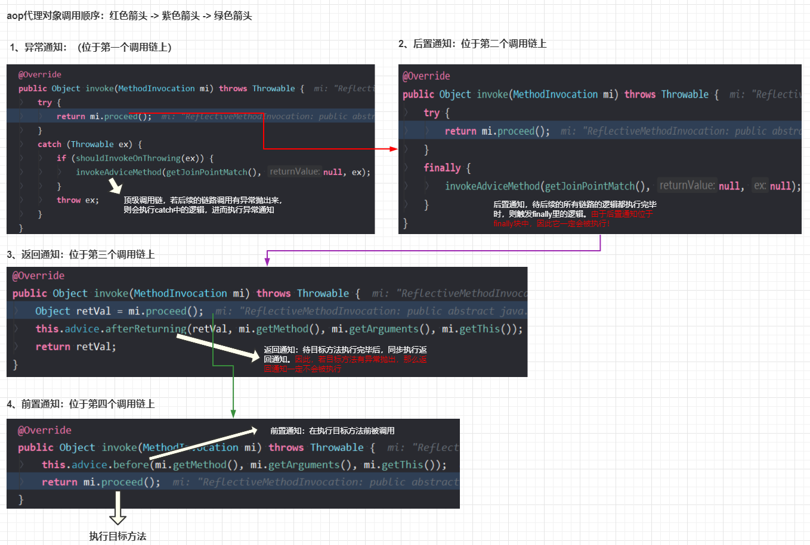

### spring aop原理篇：了解spring是如何将通知织入到目标方法 以及aop的执行顺序

#### 前言

* 在上篇文章[spring aop使用篇：熟悉使用前置通知、后置通知、返回通知、异常通知，并了解其特性](1)中我们知道了如何使用aop以及其的一些特性，同时还提出来的如下所述的疑问点：

  > 1、源码中是如何将我们定义的各种通知与目标方法绑定起来的  --> 若想急切知道答案，可直接看1.3章节
  >
  > 2、aop代理对象生成的策略   --> 若想急切知道答案，可直接看1.4章节
>
  > 3、我们的aop代理对象的执行顺序是怎样的 --> 若想急切知道答案，可直接看1.5 章节
  
  接下来，我们继续以上篇文章的测试案例为例，从源码的角度来分析这三个点。废话不多说，直接开干！

#### 一、源码中是如何将我们定义的各种通知与目标方法绑定起来的

* 如果让各位自己来实现aop你会采用什么方式？（3分钟后过后....）不管是使用哪种方式来实现，最终一定会使用**代理设计模式**。毫无疑问，我们使用代理对象来增强目标对象，然后在执行目标对象的方法之前或者之后，我们可以执行很多自定义的操作：比如前置操作、后置操作等等。那spring是如何实现aop的呢？大家都知道，在使用spring 的aop之前，我们需要定义**切面、切点、通知**，有了这三个东西后，spring才能知道要对哪个目的地（切点）做逻辑增强（通知）。接下来，咱们来分析下spring的做法。

##### 1.1 @EnableAspectJAutoProxy注解的含义

* 在使用spring时，我们通常在配置类中添加这么一个注解的话，项目的aop功能就会启动了。那这个注解在spring中主要做了什么事情呢？这与spring的**@Import**扩展点相关（如果不熟悉的话，可以看我之前spring系列相关的文章），它主要是向spring容器导入了**AspectJAutoProxyRegistrar**的bean，那这个bean做了哪些事情呢？详看下图：

  

  如图所示：其主要是往spring容器中添加了一个类型为**AnnotationAwareAspectJAutoProxyCreator**，名称叫**org.springframework.aop.config.internalAutoProxyCreator**的beanDefinition（**由于bean的名称太长，后续统一叫aopProxyCreator**）。其次，会根据@EnableAspectJAutoProxy注解配置的proxyTargetClass属性和exposeProxy属性来填充**aopProxyCreator** bean的对应字段的属性。这两个属性就涉及到了spring aop最终会使用哪种代理方式生成代理对象，以及是否可以使用`AopContext.currentProxy()`的方式获取暴露出来的代理对象。

* 分析到这，@EnableAspectJAutoProxy注解的功能就完事了。那我们接着要怎么分析呢？因为这个注解往spring容器中添加了**aopProxyCreator**的beanDefinition，最终spring容器肯定会去创建它，因为spring的很多扩展点的使用前提是，这个类得是一个spring bean。因此，我们现在去看看**aopProxyCreator**这个bean到底有什么特殊的地方。

##### 1.2 aopProxyCreator 这个bean有什么特殊点

* 在1.1章节中有说明aopProxyCreator这个bean的类型为：**AnnotationAwareAspectJAutoProxyCreator**，那我们看下这个类的**关系继承图**

  

  不看不知道，一看吓一跳。这个bean实现了Aware和BeanPostProcessor接口。毫无疑问，这属于spring扩展点范畴，spring会在合适的时机来调用这两个接口的对应方法。这里以创建aopProxyCreator这个bean为例简单描述下每个接口的大致含义即调用时机：

  | 扩展点类型                               | 作用                                                         | 触发时机                                                     |
  | ---------------------------------------- | ------------------------------------------------------------ | ------------------------------------------------------------ |
  | BeanFactoryAware                         | 可以获取到spring容器中的bean工厂对象，（**需要实现setBeanFactory方法**） | **创建当前bean时触发。eg：当前要创建aopProxyCreator这个bean，则会触发** |
  | BeanPostProcessor                        | bean后置处理器扩展点的顶级接口，在创建bean后（完成了依赖注入），回调所有后置处理器的before和after方法（**可以需要实现postProcessBeforeInitialization和postProcessAfterInitialization方法**） | **若aopProxyCreator这个bean被创建，会对后续spring创建的所有的bean生效** |
  | InstantiationAwareBeanPostProcessor      | BeanPostProcessor的子类，对BeanPostProcessor做了扩展，可以在实例化bean之前（**postProcessBeforeInstantiation**）和之后（**postProcessAfterInstantiation**）做自定义的事情。这里的实例化仅仅是创建bean对象，**还没有完成依赖注入操作**。同时，如果在postProcessAfterInstantiation方法返回false的话，spring容器将不会对这个bean做依赖注入操作。（**可以实现postProcessBeforeInstantiation和postProcessAfterInstantiation方法**） | **若aopProxyCreator这个bean被创建，会对后续spring创建的所有的bean生效** |
  | SmartInstantiationAwareBeanPostProcessor | InstantiationAwareBeanPostProcessor的子类，对InstantiationAwareBeanPostProcessor做了扩展。这个后置处理器的最重要的方法为：**determineCandidateConstructors**，最终会调用到此方法来确定当前bean要使用哪个构造方法来实例化bean（**可以实现determineCandidateConstructors方法**） | **若aopProxyCreator这个bean被创建，会对后续spring创建的所有的bean生效** |

  上述后置处理器，那他们的执行顺序是怎样的呢？别灰心，我都为你准备好了：因为了解他们的执行顺序，对理解aop原理是有帮助的。其执行顺序是这样的：

  ```txt
  第一个阶段：
  创建aopProxyCreator这个bean时触发：BeanFactoryAware#setBeanFactory
  
  第二个阶段：
  在aopProxyCreator这个bean创建后（已经加入spring容器），后续创建出来的所有bean在执行到AnnotationAwareAspectJAutoProxyCreator后置处理器时是按照如下顺序执行的：
  
  InstantiationAwareBeanPostProcessor#postProcessBeforeInstantiation
    > SmartInstantiationAwareBeanPostProcessor#determineCandidateConstructors
      > InstantiationAwareBeanPostProcessor#postProcessAfterInstantiation
        > BeanPostProcessor#postProcessBeforeInitialization
          > BeanPostProcessor#postProcessAfterInitialization
  ```
  
  但实际上，只有InstantiationAwareBeanPostProcessor#postProcessBeforeInstantiation和BeanPostProcessor#postProcessAfterInitialization这两个方法的实现和aop有关系。因此，我们着重分析下这两个方法。

##### 1.3 AnnotationAwareAspectJAutoProxyCreator的postProcessBeforeInstantiation做了什么事

* 其源码及注释如下所示：

  ```java
  @Override
  public Object postProcessBeforeInstantiation(Class<?> beanClass, String beanName) throws BeansException {
      Object cacheKey = getCacheKey(beanClass, beanName);
  
      if (!StringUtils.hasLength(beanName) || !this.targetSourcedBeans.contains(beanName)) {
          if (this.advisedBeans.containsKey(cacheKey)) {
              return null;
          }
  
          if (isInfrastructureClass(beanClass) || shouldSkip(beanClass, beanName)) {  // @1
              this.advisedBeans.put(cacheKey, Boolean.FALSE);
              return null;
          }
      }
  
      // Create proxy here if we have a custom TargetSource.
      // Suppresses unnecessary default instantiation of the target bean:
      // The TargetSource will handle target instances in a custom fashion.
      TargetSource targetSource = getCustomTargetSource(beanClass, beanName);
      if (targetSource != null) {
          if (StringUtils.hasLength(beanName)) {
              this.targetSourcedBeans.add(beanName);
          }
          Object[] specificInterceptors = getAdvicesAndAdvisorsForBean(beanClass, beanName, targetSource);
          Object proxy = createProxy(beanClass, beanName, specificInterceptors, targetSource);
          this.proxyTypes.put(cacheKey, proxy.getClass());
          return proxy;
      }
  
      return null;
  }
  ```

* @1处的代码比较核心，其主要逻辑是：判断当前bean是否为基础类（Advice.class、Pointcut.class、Advisor.class、AopInfrastructureBean.class），如果不是基础类的话，会执行**shouldSkip**方法的逻辑。而在**shouldSkip**这个方法中，会去找项目中所有的切面以及切面内部定义的**通知**（包括实现了Advisor接口的切面和通知、自定义的切面和通知）。那这个找通知的过程是如何执行的呢？这里的源码执行逻辑比较复杂，我们可以先看结果：

  

  在此方法执行完毕后，我们已经把AspectDefinition.java这个类中定义的各种通知已经找出来了，并且转化成Advisor的类型，存在了一个list中，那这一步spring到底是怎么做的呢？我们画图来详细分析下shouldSkip方法的执行流程：

  

  根据图中的分析可知，当shouldSkip方法执行完毕后，整个spring容器中所有的切面中定义的**通知**都会被缓存到内存中，大家可能会有疑惑，我怎么知道**哪个**通知适用于哪个切点呢？还记得在将通知转换成AspectJExpressionPointcut时有保存每个通知中的表达式吧？eg：`@After(value = "pointcutAnnotation()")  将获取到里面的 pointcutAnnotation() 字符串`。有了这个的话，我在找对应关系时，我看下哪个切点的方法名是这个，不就对应上了吗？

  同时，在图中有提到**InstantiationModelAwarePointcutAdvisorImpl**对象。它的本质是一个Advisor。在找通知的过程中，会将每个通知包装成**InstantiationModelAwarePointcutAdvisorImpl**类型的对象，其中这个对象中有一个特别重要的属性，就是：**instantiatedAdvice**，这个属性是Advice的类型的。其中，针对我们的通知类型，会将它转化成对应的Advice。其转换类型如下表中所示：

  | 切面中定义的通知类型 | 切面中定义的通知类型的注解 | Advice类型                  |
  | -------------------- | -------------------------- | --------------------------- |
  | AtBefore             | @Before                    | AspectJMethodBeforeAdvice   |
  | AtAfter              | @After                     | AspectJAfterAdvice          |
  | AtAfterReturning     | @AfterReturning            | AspectJAfterReturningAdvice |
  | AtAfterThrowing      | @AfterThrowing             | AspectJAfterThrowingAdvice  |
  | AtAround             | @Around                    | AspectJAroundAdvice         |

  其对应的源码如下所示：

  ```java
  AbstractAspectJAdvice springAdvice;
  
  switch (aspectJAnnotation.getAnnotationType()) {
      case AtBefore:
          springAdvice = new AspectJMethodBeforeAdvice(
              candidateAdviceMethod, expressionPointcut, aspectInstanceFactory);
          break;
      case AtAfter:
          springAdvice = new AspectJAfterAdvice(
              candidateAdviceMethod, expressionPointcut, aspectInstanceFactory);
          break;
      case AtAfterReturning:
          springAdvice = new AspectJAfterReturningAdvice(
              candidateAdviceMethod, expressionPointcut, aspectInstanceFactory);
          AfterReturning afterReturningAnnotation = (AfterReturning) aspectJAnnotation.getAnnotation();
          if (StringUtils.hasText(afterReturningAnnotation.returning())) {
              springAdvice.setReturningName(afterReturningAnnotation.returning());
          }
          break;
      case AtAfterThrowing:
          springAdvice = new AspectJAfterThrowingAdvice(
              candidateAdviceMethod, expressionPointcut, aspectInstanceFactory);
          AfterThrowing afterThrowingAnnotation = (AfterThrowing) aspectJAnnotation.getAnnotation();
          if (StringUtils.hasText(afterThrowingAnnotation.throwing())) {
              springAdvice.setThrowingName(afterThrowingAnnotation.throwing());
          }
          break;
      case AtAround:
          springAdvice = new AspectJAroundAdvice(
              candidateAdviceMethod, expressionPointcut, aspectInstanceFactory);
          break;
      case AtPointcut:
          if (logger.isDebugEnabled()) {
              logger.debug("Processing pointcut '" + candidateAdviceMethod.getName() + "'");
          }
          return null;
      default:
          throw new UnsupportedOperationException(
              "Unsupported advice type on method: " + candidateAdviceMethod);
  }
  ```

* 结论：AnnotationAwareAspectJAutoProxyCreator的postProcessBeforeInstantiation方法的主要核心在于将容器中**所有的切面对应的通知都扫描出来并包装成InstantiationModelAwarePointcutAdvisorImpl类型并添加到缓存中**（**这里要注意：不管是自定义的切面、还是实现了Advisor接口的切面都会被扫描出来**）。一种预热机制，先把数据准备好，后续需要时直接再从缓存中拿。

##### 1.4 AnnotationAwareAspectJAutoProxyCreator的postProcessAfterInitialization做了什么事

* 其源码及注释如下所示：

  ```java
  public Object postProcessAfterInitialization(@Nullable Object bean, String beanName) throws BeansException {
      if (bean != null) {
          Object cacheKey = getCacheKey(bean.getClass(), beanName);
          if (!this.earlyProxyReferences.contains(cacheKey)) {
              return wrapIfNecessary(bean, beanName, cacheKey); // @1
          }
      }
      return bean;
  }
  ```

* 这段源码的主要核心部分为：`@1`处的位置，这段代码就是创建代理对象的入口。其方法名也比较见名知意：**包装如果有必要的话**，如果你比较有经验并且知道静态代理的话。这块儿的做法也一样，其实就是生成了一个代理对象，然后将目标对象包裹在里面。那**wrapIfNecessary**这个方法到底做了什么事呢？其源码如下所示：

  ```java
  protected Object wrapIfNecessary(Object bean, String beanName, Object cacheKey) {
      if (StringUtils.hasLength(beanName) && this.targetSourcedBeans.contains(beanName)) {
          return bean;
      }
      if (Boolean.FALSE.equals(this.advisedBeans.get(cacheKey))) {
          return bean;
      }
      if (isInfrastructureClass(bean.getClass()) || shouldSkip(bean.getClass(), beanName)) { // @1
          this.advisedBeans.put(cacheKey, Boolean.FALSE);
          return bean;
      }
  
      // Create proxy if we have advice.
      Object[] specificInterceptors = getAdvicesAndAdvisorsForBean(bean.getClass(), beanName, null); // @2
      if (specificInterceptors != DO_NOT_PROXY) {
          this.advisedBeans.put(cacheKey, Boolean.TRUE);
          Object proxy = createProxy(
              bean.getClass(), beanName, specificInterceptors, new SingletonTargetSource(bean)); // @3
          this.proxyTypes.put(cacheKey, proxy.getClass()); // @4
          return proxy;
      }
  
      this.advisedBeans.put(cacheKey, Boolean.FALSE);
      return bean;
  }
  ```

* 我们先看下`@1`指向的代码，有没有觉得很相似。没错，它在1.3章节说到的**AnnotationAwareAspectJAutoProxyCreator的postProcessBeforeInstantiation**处也出现了，这是为什么呢？还记得我们在1.3章节中总结的那几个扩展点的执行顺序吧？不管一个bean需不需要被代理，都会执行AnnotationAwareAspectJAutoProxyCreator后置处理器，而`@1`指向的代码的含义仅仅是判断当前bean是否需要被代理而已，如果一个bean不需要被代理，那应该AnnotationAwareAspectJAutoProxyCreator后置处理器不应该对bean做任何操作。

* `@2`指向的代码逻辑为：看这个bean是否有定义切面，如果有，则把对应的通知都找出来，最终转化成一个个的拦截器，后续生成代理对象时，内部要维护这些拦截器，以实现调用我们定义好的通知的目的。

* `@3`指向的代码逻辑为：真实创建代理对象的逻辑，最终会调用到如下代码创建代理对象

  ```java
  // 方法坐标：org.springframework.aop.framework.DefaultAopProxyFactory#createAopProxy
  
  @Override
  public AopProxy createAopProxy(AdvisedSupport config) throws AopConfigException {
      // config.isProxyTargetClass() 获取的就是注解中@EnableAspectJAutoProxy配置的proxyTargetClass属性
      // 如果这里设置为true，则走内部逻辑，否则走@2处指向的代码处：使用jdk动态代理生成
      if (config.isOptimize() || config.isProxyTargetClass() || hasNoUserSuppliedProxyInterfaces(config)) {
          Class<?> targetClass = config.getTargetClass();
          if (targetClass == null) {
              throw new AopConfigException("TargetSource cannot determine target class: " +
                                           "Either an interface or a target is required for proxy creation.");
          }
          // 如果目标类是一个接口的话，只能使用都jdk动态代理
          if (targetClass.isInterface() || Proxy.isProxyClass(targetClass)) {
              return new JdkDynamicAopProxy(config);
          }
          return new ObjenesisCglibAopProxy(config);
      }
      else {
          return new JdkDynamicAopProxy(config);  // @2
      }
  }
  ```

  这里可以衍生出来几个面试题：

  > Q1：使用@EnableAspectJAutoProxy注解开启aop功能后，默认是使用jdk动态代理还是cglib生成代理对象？
  >
  > A1：默认是jdk动态代理生成
  >
  > ---
  >
  > Q2：使用@EnableAspectJAutoProxy注解开启aop功能后，如何让spring使用cglib生成代理对象，如何让spring使用jdk动态代理生成代理对象？
  >
  > A2：设置proxyTargetClass设置为true

  因为我们的@EnableAspectJAutoProxy注解并未指定使用cglib代理，因此，最终生成的代理对象类型为：**org.springframework.aop.framework.JdkDynamicAopProxy**（根据方法的返回值签名知道的）。
  

##### 1.5 代理对象的执行过程

* 在1.4章节中有说到，最终ObjectServiceImpl生成的代理对象类型为：**org.springframework.aop.framework.JdkDynamicAopProxy**。如果大家熟悉jdk动态代理的话，我们可以直接到**JdkDynamicAopProxy**类中找invoke方法。invoke方法就是我们代理对象的执行入口了

* invoke方法的逻辑比较长，其中有对一些基础方法的判断，对于Object类的equals、hashCode方法则不进行代理，直接执行目标方法。因此，剩下的就是需要被代理的逻辑了，下面的代码演示展示的就是代理方法的逻辑：

  ```java
  // 方法坐标：org.springframework.aop.framework.JdkDynamicAopProxy#invoke
  
  @Override
  @Nullable
  public Object invoke(Object proxy, Method method, Object[] args) throws Throwable {
      MethodInvocation invocation;
      Object oldProxy = null;
      boolean setProxyContext = false;
  
      // 获取目标对象的包装器
      TargetSource targetSource = this.advised.targetSource;
      Object target = null;
      try {
          Object retVal;
  
          // 还记得@EnableAspectJAutoProxy注解的exposeProxy属性吗，我们设置为true的话，就会将代理对象暴露到线程变量中
          if (this.advised.exposeProxy) {
  		   // 将代理对象放到ThreadLocal中，我们可以使用AopContext.currentProxy()获取到当前的代理对象
              oldProxy = AopContext.setCurrentProxy(proxy);
              setProxyContext = true;
          }
  
          // 获取真实的目标对象
          target = targetSource.getTarget();
          Class<?> targetClass = (target != null ? target.getClass() : null);
  
          // 这一步：获取当前执行的目标方法，已经为目标方法定义的一些通知，最终以拦截器的方式存储在list中
          List<Object> chain = this.advised.getInterceptorsAndDynamicInterceptionAdvice(method, targetClass); // @1
  
          if (chain.isEmpty()) {
              // 省略无关代码
          }
          else {
              // 构建链路的调用器
              invocation = new ReflectiveMethodInvocation(proxy, target, method, args, targetClass, chain); // @2
              // 开始执行链路上的方法
              retVal = invocation.proceed(); // @3
          }
  
          return retVal;
      } finally {
          if (target != null && !targetSource.isStatic()) {
              // Must have come from TargetSource.
              targetSource.releaseTarget(target);
          }
          if (setProxyContext) {
              // Restore old proxy.
              AopContext.setCurrentProxy(oldProxy);
          }
      }
  }
  ```

* 上述`@1`处指定的代码处主要是获取一个方法调用链路，如果熟悉责任链设计模式的话，这一步相当于是构建所有的链路

* 上述`@2`处指定的代码处主要是构建一个方法调用入口，如果熟悉责任链设计模式的话，这一步相当于是将所有的链路铺好（哪个链要放在第一个位置被调用，哪个链要放在第二个位置被调用、哪个链要放在最后一个位置被调用），等待被触发

* 上述`@3`处指定的代码为链路的执行者，表示要开始执行链路上的所以方法了。

* 这个链路的模样及执行过程见下图：

  
  
  由上述图分析可知，想必大家明白在上篇文章[spring aop使用篇：熟悉使用前置通知、后置通知、返回通知、异常通知，并了解其特性](1)中对有介绍到各种通知的特性有所了解了吧？首先，方法调用栈是从异常通知开始的，在异常通知中有一个大的try catch块，它能捕获到链路中抛出的异常，进而执行异常通知。其次，后置通知处于第二个链路中，由于内部有try finally块，而在finally块中执行的是后置通知，所以后置通知是一定会被执行的。再其次，返回通知位于第三个链路中，在返回通知中，并没有try finally代码块，因此返回通知不一定会被执行。最后，前置通知位于第四个链路中，其与目标方法的执行是同步的。通过上述的分析可知，只有前置通知是在目标方法执行之前触发的，剩下的后置通知、返回通知、异常通知都要等目标方法执行完毕后再根据代码的逻辑执行不同的通知逻辑。

#### 二、总结

* Spring AOP的原理，从源码的层面出发，从@EnableAspectJAutoProxy注解开始，到生成代理对象以及代理对象的执行顺序都大致总结了一遍。

* **如果你觉得我的文章有用的话，欢迎点赞、收藏和关注。:laughing:**
* **I'm a slow walker, but I never walk backwards**