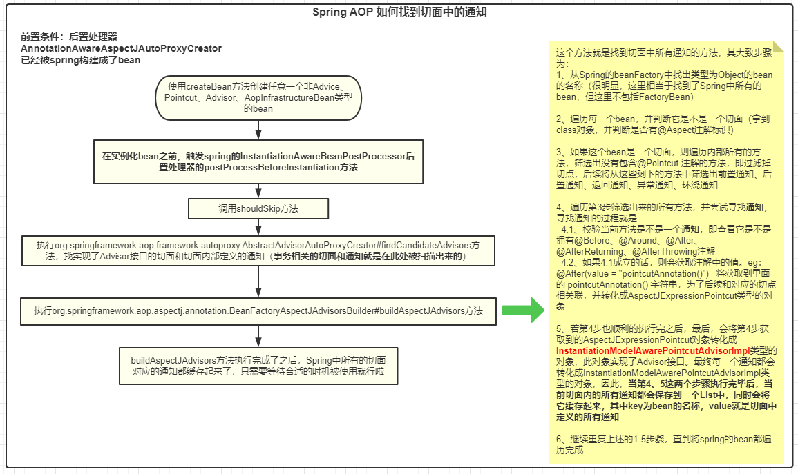

### spring aop原理篇：了解spring是如何将切面织入到目标方法 以及aop的执行顺序

#### 前言

* 在上篇文章[spring aop使用篇：熟悉使用前置通知、后置通知、返回通知、异常通知，并了解其特性](1)中我们知道了如何使用aop以及其的一些特性，同时还提出来的如下所述的疑问点：

  > 1、源码中是如何将我们定义的各种通知与目标方法绑定起来的
  > 2、我们的aop代理对象的执行顺序是怎样的
  > 3、aop代理对象生成的策略

  接下来，我们继续以上篇文章的例子为例，从源码的角度来分析这三个点。废话不多说，直接开干！

#### 一、源码中是如何将我们定义的各种通知与目标方法绑定起来的

* 如果让各位自己来实现aop你会采用什么方式？不管是使用哪种方式来实现，最终一定会使用**代理设计模式**。毫无疑问，我们使用代理对象来增强目标对象，然后在执行目标对象的方法之前或者之后，我们可以执行很多自定义的操作：比如前置操作、后置操作等等。那spring是如何实现aop的呢？大家都知道，在使用spring 的aop之前，我们需要定义**切面、切点、通知**，有了这三个东西后，spring才能知道要对哪个目的地（切点）做逻辑增强（通知）。接下来，咱们来分析下spring的做法。

##### 1.1 @EnableAspectJAutoProxy注解的含义

* 在使用spring时，我们通常在配置类中添加这么一个注解的话，项目的aop功能就会启动了。那这个注解在spring中主要做了什么事情呢？这与spring的**@Import**扩展点相关（如果不熟悉的话，可以看我之前spring系列相关的文章），它主要是向spring容器导入了**AspectJAutoProxyRegistrar**的bean，那这个bean做了哪些事情呢？详看下图：

  

  如图所示：其主要是往spring容器中添加了一个类型为**AnnotationAwareAspectJAutoProxyCreator**，名称叫**org.springframework.aop.config.internalAutoProxyCreator**的beanDefinition（**由于bean的名称太长，后续统一叫aopProxyCreator**）。其次，会根据@EnableAspectJAutoProxy注解配置的proxyTargetClass属性和exposeProxy属性来填充**aopProxyCreator** bean的对应字段的属性。这两个属性就涉及到了spring aop最终会使用哪种代理方式生成代理对象，以及是否可以使用`AopContext.currentProxy()`的方式获取暴露出来的代理对象。

* 分析到这，@EnableAspectJAutoProxy注解的功能就完事了。那我们接着要怎么分析呢？因为这个注解往spring容器中添加了**aopProxyCreator**的beanDefinition，最终spring容器肯定会去创建它，因为spring的很多扩展点的使用前提是，这个类得是一个spring bean。因此，我们现在去看看**aopProxyCreator**这个bean到底有什么特殊的地方。

##### 1.2 aopProxyCreator 这个bean有什么特殊点

* 在1.1章节中有说明aopProxyCreator这个bean的类型为：**AnnotationAwareAspectJAutoProxyCreator**，那我们看下这个类的**关系继承图**

  

  不看不知道，一看吓一跳。这个bean实现了Aware和BeanPostProcessor接口。毫无疑问，这属于spring扩展点范畴，spring会在合适的时机来调用这两个接口的对应方法。这里以创建aopProxyCreator这个bean为例简单描述下每个接口的大致含义即调用时机：

  | 扩展点类型                               | 作用                                                         | 触发时机                                                     |
  | ---------------------------------------- | ------------------------------------------------------------ | ------------------------------------------------------------ |
  | BeanFactoryAware                         | 可以获取到spring容器中的bean工厂对象，（**需要实现setBeanFactory方法**） | **创建当前bean时触发。eg：当前要创建aopProxyCreator这个bean，则会触发** |
  | BeanPostProcessor                        | bean后置处理器扩展点的顶级接口，在创建bean后（完成了依赖注入），回调所有后置处理器的before和after方法（**可以需要实现postProcessBeforeInitialization和postProcessAfterInitialization方法**） | **若aopProxyCreator这个bean被创建，会对后续spring创建的所有的bean生效** |
  | InstantiationAwareBeanPostProcessor      | BeanPostProcessor的子类，对BeanPostProcessor做了扩展，可以在实例化bean之前（**postProcessBeforeInstantiation**）和之后（**postProcessAfterInstantiation**）做自定义的事情。这里的实例化仅仅是创建bean对象，**还没有完成依赖注入操作**。同时，如果在postProcessAfterInstantiation方法返回false的话，spring容器将不会对这个bean做依赖注入操作。（**可以实现postProcessBeforeInstantiation和postProcessAfterInstantiation方法**） | **若aopProxyCreator这个bean被创建，会对后续spring创建的所有的bean生效** |
  | SmartInstantiationAwareBeanPostProcessor | InstantiationAwareBeanPostProcessor的子类，对InstantiationAwareBeanPostProcessor做了扩展。这个后置处理器的最重要的方法为：**determineCandidateConstructors**，最终会调用到此方法来确定当前bean要使用哪个构造方法来实例化bean（**可以实现determineCandidateConstructors方法**） | **若aopProxyCreator这个bean被创建，会对后续spring创建的所有的bean生效** |

  上述后置处理器，那他们的执行顺序是怎样的呢？别灰心，我都为你准备好了：因为了解他们的执行顺序，对理解aop原理是有帮助的。其执行顺序是这样的：

  ```txt
  第一个阶段：
  创建aopProxyCreator这个bean时触发：BeanFactoryAware#setBeanFactory
  
  第二个阶段：
  在aopProxyCreator这个bean创建后（已经加入spring容器），后续创建出来的所有bean在执行到AnnotationAwareAspectJAutoProxyCreator后置处理器时是按照如下顺序执行的：
  
  InstantiationAwareBeanPostProcessor#postProcessBeforeInstantiation
    > SmartInstantiationAwareBeanPostProcessor#determineCandidateConstructors
      > InstantiationAwareBeanPostProcessor#postProcessAfterInstantiation
        > BeanPostProcessor#postProcessBeforeInitialization
          > BeanPostProcessor#postProcessAfterInitialization
  ```
  
  但实际上，只有InstantiationAwareBeanPostProcessor#postProcessBeforeInstantiation和BeanPostProcessor#postProcessAfterInitialization这两个方法的实现和aop有关系。因此，我们着重分析下这两个方法。

##### 1.3 AnnotationAwareAspectJAutoProxyCreator的postProcessBeforeInstantiation做了什么事

* 其源码及注释如下所示：

  ```java
      @Override
  	public Object postProcessBeforeInstantiation(Class<?> beanClass, String beanName) throws BeansException {
  		Object cacheKey = getCacheKey(beanClass, beanName);
  
  		if (!StringUtils.hasLength(beanName) || !this.targetSourcedBeans.contains(beanName)) {
  			if (this.advisedBeans.containsKey(cacheKey)) {
  				return null;
  			}
  
  			if (isInfrastructureClass(beanClass) || shouldSkip(beanClass, beanName)) {  // @1
  				this.advisedBeans.put(cacheKey, Boolean.FALSE);
  				return null;
  			}
  		}
  
  		// Create proxy here if we have a custom TargetSource.
  		// Suppresses unnecessary default instantiation of the target bean:
  		// The TargetSource will handle target instances in a custom fashion.
  		TargetSource targetSource = getCustomTargetSource(beanClass, beanName); // @2
  		if (targetSource != null) {
  			if (StringUtils.hasLength(beanName)) {
  				this.targetSourcedBeans.add(beanName);
  			}
  			Object[] specificInterceptors = getAdvicesAndAdvisorsForBean(beanClass, beanName, targetSource);
  			Object proxy = createProxy(beanClass, beanName, specificInterceptors, targetSource);
  			this.proxyTypes.put(cacheKey, proxy.getClass());
  			return proxy;
  		}
  
  		return null;
  	}
  ```

* @1处的代码比较核心，其主要逻辑是：判断当前bean是否为基础类（Advice.class、Pointcut.class、Advisor.class、AopInfrastructureBean.class），如果不是基础类的话，会执行**shouldSkip**方法的逻辑，在这个方法中，会去找当前bean的所有**通知**。那这个找通知的过程是如何执行的呢？这里的源码执行逻辑比较复杂，我们可以先看结果：

  

  在此方法执行完毕后，我们已经把AspectDefinition.java这个类中定义的各种通知已经找出来了，并且转化成Advisor的类型，存在了一个list中，那这一步spring到底是怎么做的呢？我们画图来详细分析下shouldSkip方法的执行流程：

  

  根据图中的分析可知，当shouldSkip方法执行完毕后，整个spring容器中所有的切面中定义的**通知**都会被缓存到内存中，大家可能会有疑惑，我怎么知道**哪个**通知适用于哪个切点呢？还记得在将通知转换成AspectJExpressionPointcut时有保存每个通知中的表达式吧？eg：`@After(value = "pointcutAnnotation()")  将获取到里面的 pointcutAnnotation() 字符串`。有了这个的话，我在找对应关系时，我看下哪个切点的方法名是这个，不就对应上了吗？

* @2处的代码是自定义代理对象逻辑，我们很少用到，直接跳过。
* 结论：AnnotationAwareAspectJAutoProxyCreator的postProcessBeforeInstantiation方法的主要核心在于将容器中所有的切面对应的切点都扫描出来并转化成InstantiationModelAwarePointcutAdvisorImpl并缓存起来了。一种预热机制，先把数据准备好，后续需要时直接再从缓存中拿。

##### 1.4 BeanPostProcessor#postProcessAfterInitialization做了什么事