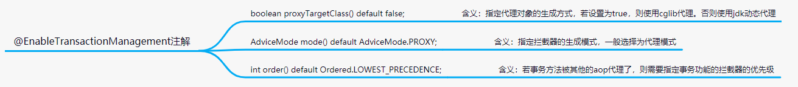
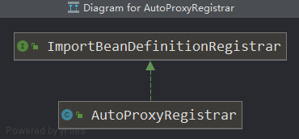
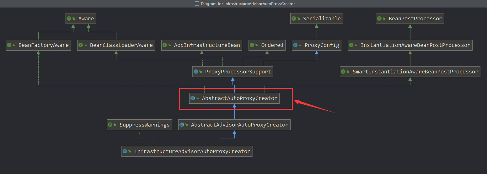
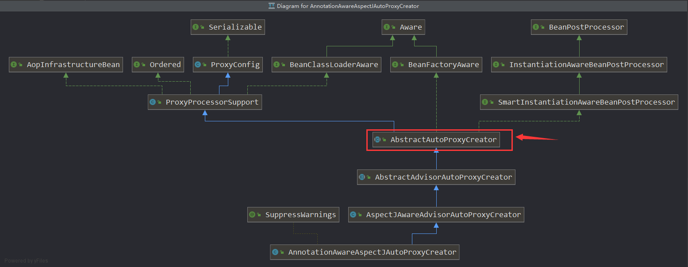
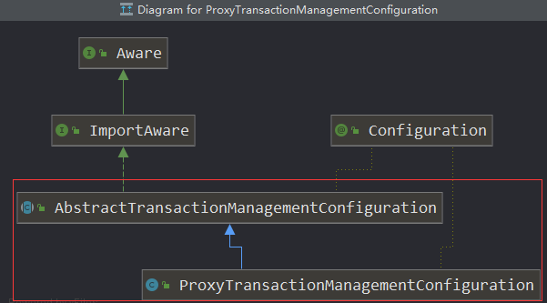
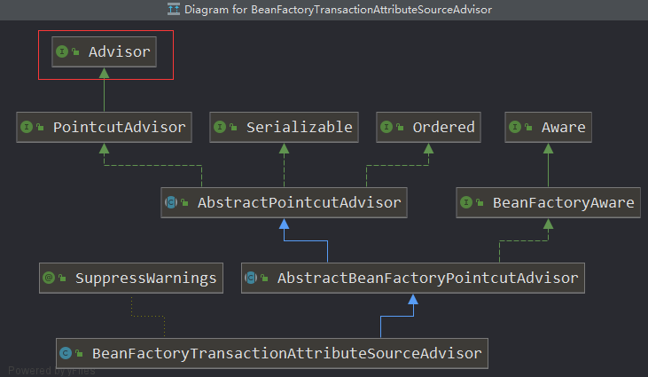
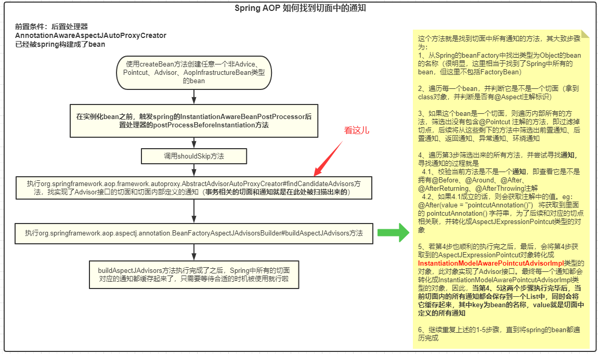
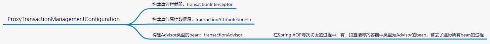
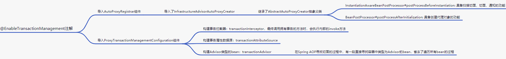

# Spring 事务原理篇：@EnableTransactionManagement注解底层究竟干了啥，能让我们这么愉快的使用声明式事务

## 前言

* 学习了关于Spring AOP原理以及事务的基础知识后，今天咱们来聊聊Spring在底层是如何操作事务的。如果阅读到此文章，并且对Spring AOP原理不太了解的话，建议先阅读下本人的这篇文章：[Spring AOP原理篇：我用上我的洪荒之力来帮你彻底了解aop注解@EnableAspectJAutoProxy的原理](https://blog.csdn.net/avengerEug/article/details/118301931)的文章，后文的内容与这篇文章有很大的关联关系。

## 一、先说说@EnableTransactionManagement注解内部有哪些方法

* 我们看下@EnableTransactionManagement注解的源码：

  ```java
  @Target(ElementType.TYPE)
  @Retention(RetentionPolicy.RUNTIME)
  @Documented
  @Import(TransactionManagementConfigurationSelector.class)
  public @interface EnableTransactionManagement {
  
  	// 忽略注释
  	boolean proxyTargetClass() default false;
  
  	// 忽略注释
  	AdviceMode mode() default AdviceMode.PROXY;
  
  	// 忽略注释
  	int order() default Ordered.LOWEST_PRECEDENCE;
  }
  ```

  其主要拥有三个方法，并且每个方法都有默认的值。通常情况下，我们使用@EnableTransactionManagement注解时，并不会额外的指定内部方法的返回值，用的都是默认值。那这三个方法的返回值具体有什么作用呢？请看下图：

  

  具体什么时候会用到，我们后面会说到。

## 二、再聊聊@EnableTransactionManagement注解在底层做了什么事

* 套路与`@EnableAspectJAutoProxy`注解类似，都是向Spring导入了一个**TransactionManagementConfigurationSelector**组件，它是属于ImportSelector类型。我们来看下它的源码：

  ```java
  public class TransactionManagementConfigurationSelector extends AdviceModeImportSelector<EnableTransactionManagement> {
  
  	@Override
  	protected String[] selectImports(AdviceMode adviceMode) {
           // 这个adviceMode就是我们在使用@EnableTransactionManagement注解时内部的model()方法的返回值
           // 我们没有操作过@EnableTransactionManagement注解内部所有方法的返回值，因此，这里的adviceMode
           // 的值为 “PROXY”
  		switch (adviceMode) {
  			case PROXY:
                    // 最终会执行这段代码，向Spring容器添加了两个bean，分别为：
                    // AutoProxyRegistrar和ProxyTransactionManagementConfiguration
                    // 要想了解Spring的底层原理，那现在就要看AutoProxyRegistrar和ProxyTransactionManagementConfiguration咯
  				return new String[] {AutoProxyRegistrar.class.getName(), ProxyTransactionManagementConfiguration.class.getName()};
  			case ASPECTJ:
  				return new String[] {TransactionManagementConfigUtils.TRANSACTION_ASPECT_CONFIGURATION_CLASS_NAME};
  			default:
  				return null;
  		}
  	}
  }
  ```

### 2.1 AutoProxyRegistrar的庐山真面目

* 我们先来看看它是什么类型：

  

  根据类的继承图可知，它属于**ImportBeanDefinitionRegistrar**类型，Spring最终会调用内部的**registerBeanDefinitions**方法，下述是源码中比较关键的代码：

  ```java
  if (mode == AdviceMode.PROXY) {
      AopConfigUtils.registerAutoProxyCreatorIfNecessary(registry);
      if ((Boolean) proxyTargetClass) {
          AopConfigUtils.forceAutoProxyCreatorToUseClassProxying(registry);
          return;
      }
  }
  ```

  上文有说到，我们在使用@EnableTransactionManagement注解时，并没有特意去修改内部方法的返回值。因此，这里的mode就是**AdviceMode.PROXY**，proxyTargetClass为**false**。由源码逻辑可知：Spring最终会执行这段代码：`AopConfigUtils.registerAutoProxyCreatorIfNecessary(registry);`而这段代码的主要功能就是向Spring容器中添加这个bean：**InfrastructureAdvisorAutoProxyCreator**。那我们接下来该干嘛呢？是的，该看这个bean (**InfrastructureAdvisorAutoProxyCreator**)有什么样的作用了。


#### 2.1.1  InfrastructureAdvisorAutoProxyCreator的作用

* 同理，咱们先来看下它的继承图：

  

  我们着重看图中**红框框**中的类。然后我们再来看下在启用Spring AOP的注解@EnableAspectJAutoProxy内部导入的**AnnotationAwareAspectJAutoProxyCreator** bean的类继承图：

  

  他们都实现了同一个公共抽象类：**AbstractAutoProxyCreator**。这说明什么？这说明了只要`AnnotationAwareAspectJAutoProxyCreator和InfrastructureAdvisorAutoProxyCreator内部没有对AbstractAutoProxyCreator这个抽象父类做任何方法的重写的话，那他们就是拥有了AbstractAutoProxyCreator的功能。`实际上呢，他们确实是没有重写AbstractAutoProxyCreator内部的任何方法。在[Spring AOP原理篇：我用上我的洪荒之力来帮你彻底了解aop注解@EnableAspectJAutoProxy的原理](https://blog.csdn.net/avengerEug/article/details/118301931)的文章中有提到，整个Spring AOP寻找切面、切面、通知的过程就是此方法**InstantiationAwareBeanPostProcessor#postProcessBeforeInstantiation**的功劳，而生成AOP代理对象就是**BeanPostProcessor#postProcessAfterInitialization**的功劳。而这些寻找切面、生成代理对象的功能其实是抽象父类**AbstractAutoProxyCreator**的功能。因此，我们的**InfrastructureAdvisorAutoProxyCreator**具备了寻找切面、切面、通知以及生成代理对象的功能了。

####  2.1.2 总结

* 因此，AutoProxyRegistrar的作用可以用下图来表示：

  

### 2.2  ProxyTransactionManagementConfiguration的庐山真面目

* 老规矩，先看类的继承图：

  

  这个类倒比较简单了，它也使用到了Spring的一些扩展点，虽然父类也有构建一些Spring的组件，但最终要的是ProxyTransactionManagementConfiguration内部构建了一个叫**BeanFactoryTransactionAttributeSourceAdvisor**的bean。ProxyTransactionManagementConfiguration的源码如下所示：

  ```java
  @Configuration
  public class ProxyTransactionManagementConfiguration extends AbstractTransactionManagementConfiguration {
  
      // 主要是这个bean
  	@Bean(name = TransactionManagementConfigUtils.TRANSACTION_ADVISOR_BEAN_NAME)
  	@Role(BeanDefinition.ROLE_INFRASTRUCTURE)
  	public BeanFactoryTransactionAttributeSourceAdvisor transactionAdvisor() {
  		BeanFactoryTransactionAttributeSourceAdvisor advisor = new BeanFactoryTransactionAttributeSourceAdvisor();
           // 内部维护了事务相关的属性源
  		advisor.setTransactionAttributeSource(transactionAttributeSource());
           // 内部维护了执行事务时的拦截器，后续会依赖这个拦截器来开启、提交/回滚事务
           // 当调用拥有事务的方法时，最终会调用到此拦截器内部的invoke方法
  		advisor.setAdvice(transactionInterceptor());
  		if (this.enableTx != null) {
  			advisor.setOrder(this.enableTx.<Integer>getNumber("order"));
  		}
  		return advisor;
  	}
  
  	@Bean
  	@Role(BeanDefinition.ROLE_INFRASTRUCTURE)
  	public TransactionAttributeSource transactionAttributeSource() {
  		return new AnnotationTransactionAttributeSource();
  	}
  
  	@Bean
  	@Role(BeanDefinition.ROLE_INFRASTRUCTURE)
  	public TransactionInterceptor transactionInterceptor() {
  		TransactionInterceptor interceptor = new TransactionInterceptor();
  		interceptor.setTransactionAttributeSource(transactionAttributeSource());
  		if (this.txManager != null) {
  			interceptor.setTransactionManager(this.txManager);
  		}
  		return interceptor;
  	}
  
  }
  ```

  按照惯例，我们来看看这个bean：BeanFactoryTransactionAttributeSourceAdvisor的信息。

#### 2.2.1 BeanFactoryTransactionAttributeSourceAdvisor的作用

* 老规矩，我们来看它的类继承图：

  

  可以发现，它属于Advisor类型。这个时候，我们回忆一下Spring AOP在查询切面、切点、通知的时候，**是不是存在一个寻找Advisor的过程**？如果你记不清了没关系，我们再来温故下。继续选用上篇文章使用过的图：

  

  其中有一段寻找实现了Advisor接口的逻辑，其部分代码如下所示：

  ```java
  // 方法坐标：org.springframework.aop.framework.autoproxy.BeanFactoryAdvisorRetrievalHelper#findAdvisorBeans
  
  public List<Advisor> findAdvisorBeans() {
      String[] advisorNames = this.cachedAdvisorBeanNames;
      if (advisorNames == null) {
          // 查找出spring容器中类型为advisor类型的bean
          advisorNames = BeanFactoryUtils.beanNamesForTypeIncludingAncestors(
              this.beanFactory, Advisor.class, true, false);
          this.cachedAdvisorBeanNames = advisorNames;
      }
      if (advisorNames.length == 0) {
          return new ArrayList<>();
      }
      
      //.... 省略 遍历所有bean，寻找带有@Aspectj注解的bean并解析bean的过程 逻辑。
  }
  ```

* 还记得这个方法吗？这个方法就是找到我们所有的切面，并解析成一个个的Advisor。而在寻找事务切面的过程中，并没有遍历所有的bean，因为我们的@EnableTransactionManagement注解已经向spring容器中导入了一个Advisor了。因此，对于在寻找事务切面的过程而言，事务的性能更好一点。因为，它省去了遍历所有bean的过程，在使用@EnableTransactionManagement注解时已经自动为我们导入了一个类型为Advisor的bean。

#### 2.2.2 总结

*  ProxyTransactionManagementConfiguration的作用可以用下图来总结：

  

### 2.3 总结

* 综上所述，我们的@EnableTransactionManagement注解在底层做的事就非常明了了，用一幅图总结：

  

  

## 三、事务在底层的执行原理

* 此部分不再打算继续分析了，因为其执行步骤和原理在[Spring AOP原理篇：我用上我的洪荒之力来帮你彻底了解aop注解@EnableAspectJAutoProxy的原理](https://blog.csdn.net/avengerEug/article/details/118301931)中已经分析过了，还是通过责任链设计模式调用的，只不过链路上的具体操作可能不太一样。在AOP中，链路上的个链的功能就是负责调用我们定义的各种通知。而在事务的调用链路中，只有一条链，就是在ProxyTransactionManagementConfiguration内部定义的transactionInterceptor，在此链路中会根据当前方法的事务隔离机制来做一些额外的处理，不过主线流程就是开启事务、提交/回滚事务。如果想了解其内部的调用细节，可以参考此方法：**org.springframework.transaction.interceptor.TransactionInterceptor#invoke**

## 四、总结

* Spring事务的底层原理还是比较简单的，与Spring AOP大同小异。唯一需要注意的也就是Spring的事务隔离级别和事务传播机制的特性了，这块的特性肯定与上述说的transactionInterceptor有关系。如果想详细了解其执行原理的话，可以细究此方法：**org.springframework.transaction.interceptor.TransactionInterceptor#invoke**（所有调用拥有事务特性的方法都会走到这里）。
* **如果你觉得我的文章有用的话，欢迎点赞、收藏和关注。:laughing:**
* **I'm a slow walker, but I never walk backwards**

