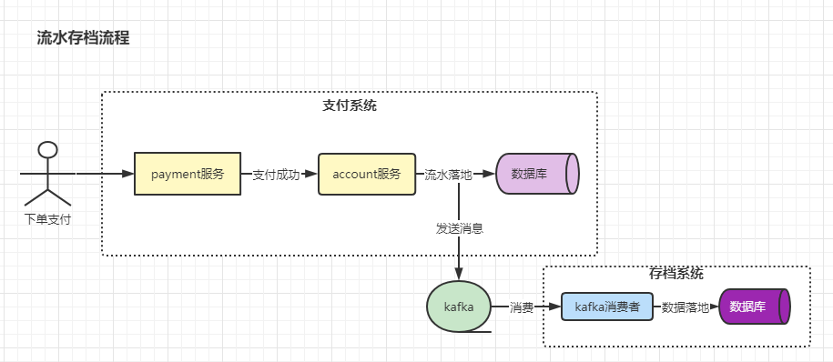
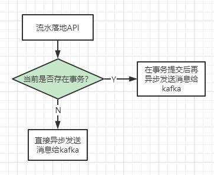
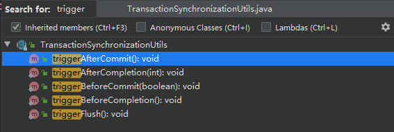
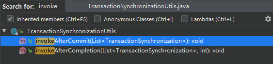

# Spring 事务的独门绝技：事务钩子函数的使用技巧

## 前言

* 经过前面对Spring AOP、事务的总结，我们已经对它们有了一个比较感性的认知了。今天，我继续安利一个**独门绝技**：Spring 事务的钩子函数。单纯的讲技术可能比较枯燥乏味。接下来，我将以一个实际的案例来描述Spring事务钩子函数的正确使用姿势。

## 一、案例背景

* 拿支付系统相关的业务来举例。在支付系统中，我们需要记录每个账户的资金流水（记录用户A因为哪个操作扣了钱，因为哪个操作加了钱），这样我们才能对每个账户的**账**做到心中有数，对于支付系统而言，资金流水的数据可谓是**最重要**的。因此，为了防止支付系统的老大**徇私舞弊**，CTO提了一个**流水存档**的需求：要求支付系统对每个账户的资金流水做一份存档，要求支付系统在写流水的时候，把流水相关的信息以消息的形式推送到kafka，由**存档系统**消费这个消息并落地到库里（这个库只有**存档系统**拥有写权限）。整个需求的流程如下所示：

  

  整个需求的流程还是比较简单的，考虑到后续会有其他事业部也要进行数据存档操作，CTO建议支付系统团队内部开发一个二方库，这个二方库的主要功能就是发送消息到kafka中去。

## 二、确定方案

* 既然要求开发一个二方库，因此，我们需要考虑如下几件事情：

  > 1、技术栈使用的springboot，因此，这里最好以starter的方式提供
  >
  > 2、二方库需要发送消息给kafka，最好是二方库内部基于kafka生产者的api创建生产者，不要使用Spring自带的kafkaTemplate，因为集成方有可能已经使用了kafkaTemplate。不能与集成方造成冲突。
  >
  > 3、减少对接方的集成难度、学习成本，最好是提供一个简单实用的api，业务侧能简单上手。
  >
  > 4、**发送消息这个操作需要支持事务，尽量不影响主业务**

  在上述的几件事情中，最需要注意的应该就是第4点：**发送消息这个操作需要支持事务，尽量不影响主业务**。这是什么意思呢？首先，尽量不影响主业务，这个最简单的方式就是使用**异步**机制。其次，需要支持事务是指：**假设我们的api调用是在事务方法内部，那么我们需要保证事务提交后再执行这个api**。那么，我们的流水落地api应该要有这样的功能：

  

  内部可以判断当前是否存在事务，如果存在事务，则需要等事务提交后再异步发送消息给kafka。如果不存在事务则直接异步发送消息给kafka。而且这样的判断逻辑得放在二方库内部才行。那现在摆在我们面前的问题就是：**我要如何判断当前是否存在事务，以及如何在事务提交后再触发我们自定义的逻辑呢？**

## 三、TransactionSynchronizationManager显神威

* 这个类内部所有的变量、方法都是static修饰的，也就是说它其实是一个工具类。是一个**事务同步器**。下述是**流水落地API**的伪代码，这段代码就解决了我们上述提到的疑问：

  ```java
  private final ExecutorService executor = Executors.newSingleThreadExecutor();
  
  public void sendLog() {
      // 判断当前是否存在事务
      if (!TransactionSynchronizationManager.isSynchronizationActive()) {
          // 无事务，异步发送消息给kafka
          
          executor.submit(() -> {
              // 发送消息给kafka
              try {
                  // 发送消息给kafka
              } catch (Exception e) {
                  // 记录异常信息，发邮件或者进入待处理列表，让开发人员感知异常
              }
          });
          return;
      }
  
      // 有事务，则添加一个事务同步器，并重写afterCompletion方法（此方法在事务提交后会做回调）
      TransactionSynchronizationManager.registerSynchronization(new TransactionSynchronizationAdapter() {
  
          @Override
          public void afterCompletion(int status) {
              if (status == TransactionSynchronization.STATUS_COMMITTED) {
                  // 事务提交后，再异步发送消息给kafka
                  executor.submit(() -> {
                      try {
  	                    // 发送消息给kafka
                      } catch (Exception e) {
      	                // 记录异常信息，发邮件或者进入待处理列表，让开发人员感知异常
                      }
                  });
              }
          }

      });
  
  }
  ```
  
  代码比较简单，其主要是**TransactionSynchronizationManager**的使用。

### 3.1、判断是否存在事务？TransactionSynchronizationManager.isSynchronizationActive() 方法显神威

* 我们先看下这个方法的源码：

  ```java
  // TransactionSynchronizationManager.java类内部的部分代码
  
  private static final ThreadLocal<Set<TransactionSynchronization>> synchronizations =
  			new NamedThreadLocal<>("Transaction synchronizations");
  
  public static boolean isSynchronizationActive() {
      return (synchronizations.get() != null);
  }
  ```

  很明显，synchronizations是一个线程变量（ThreadLocal）。那它是在什么时候set进去的呢？这里的话，可以参考下这个方法：org.springframework.transaction.support.TransactionSynchronizationManager#initSynchronization，其源码如下所示：

  ```java
  /**
    * Activate transaction synchronization for the current thread.
    * Called by a transaction manager on transaction begin.
    * @throws IllegalStateException if synchronization is already active
    */
  public static void initSynchronization() throws IllegalStateException {
      if (isSynchronizationActive()) {
          throw new IllegalStateException("Cannot activate transaction synchronization - already active");
      }
      logger.trace("Initializing transaction synchronization");
      synchronizations.set(new LinkedHashSet<>());
  }
  ```

  由源码中的注释也可以知道，它是在事务管理器开启事务时调用的。换句话说，只要我们的程序执行到带有事务特性的方法时，就会在线程变量中放入一个LinkedHashSet，用来标识当前存在事务。只要isSynchronizationActive返回true，则代表当前有事务。因此，结合这两个方法我们是指能解决我们最开始提出的疑问：**`要如何判断当前是否存在事务`**

### 3.2、如何在事务提交后触发自定义逻辑？TransactionSynchronizationManager.registerSynchronization()方法显神威

* 我们来看下这个方法的源代码：

  ```java
  /**
    * Register a new transaction synchronization for the current thread.
    * Typically called by resource management code.
    * <p>Note that synchronizations can implement the
    * {@link org.springframework.core.Ordered} interface.
    * They will be executed in an order according to their order value (if any).
    * @param synchronization the synchronization object to register
    * @throws IllegalStateException if transaction synchronization is not active
    * @see org.springframework.core.Ordered
    */
  public static void registerSynchronization(TransactionSynchronization synchronization)
      throws IllegalStateException {
  
      Assert.notNull(synchronization, "TransactionSynchronization must not be null");
      if (!isSynchronizationActive()) {
          throw new IllegalStateException("Transaction synchronization is not active");
      }
      synchronizations.get().add(synchronization);
  }
  ```

  这里又使用到了synchronizations线程变量，我们在判断是否存在事务时，就是判断这个线程变量内部是否有值。那我们现在想在**事务提交后触发自定义逻辑**和这个有什么关系呢？我们在上面构建**流水落地api**的伪代码中有向synchronizations内部添加了一个TransactionSynchronizationAdapter，内部并重写了afterCompletion方法，其代码如下所示：

  ```java
  TransactionSynchronizationManager.registerSynchronization(new TransactionSynchronizationAdapter() {
  
      @Override
      public void afterCompletion(int status) {
          if (status == TransactionSynchronization.STATUS_COMMITTED) {
              // 事务提交后，再异步发送消息给kafka
              executor.submit(() -> {
                      try {
  	                    // 发送消息给kafka
                      } catch (Exception e) {
      	                // 记录异常信息，发邮件或者进入待处理列表，让开发人员感知异常
                      }
              });
          }
      }
  
  });
  ```

  我们结合registerSynchronization的源码来看，其实这段代码主要就是向线程变量内部的LinkedHashSet添加了一个对象而已，但就是这么一个操作，让Spring在事务执行的过程中变得`“有事情可做”`。这是什么意思呢？是因为Spring在执行事务方法时，对于操作事务的每一个阶段都有一个回调操作，比如：trigger系列的回调

  

  invoke系列的回调

  

  而我们现在的需求就是在事务提交后触发自定义的函数，那就是在invokeAfterCommit和invokeAfterCompletion这两个方法来选了。首先，这两个方法都会拿到所有TransactionSynchronization的集合（其中会包括我们上述添加的TransactionSynchronizationAdapter）。但是要注意一点：invokeAfterCommit只能拿到集合，invokeAfterCompletion除了集合还有一个int类型的参数，而这个int类型的参数其实是当前事务的一种状态。也就是说，如果我们重写了invokeAfterCompletion方法，我们除了能拿到集合外，还能拿到当前事务的状态。因此，此时我们可以根据这个状态来做不同的事情，比如：可以在事务提交时做自定义处理，也可以在事务回滚时做自定义处理等等。

## 四、总结

* 上面有说到，我们**判断当前是否存在事务、添加钩子函数**都是依赖线程变量的。因此，我们在使用过程中，一定要**避免切换线程**。否则会出现**不生效**的情况。
* **如果你觉得我的文章有用的话，欢迎点赞、收藏和关注。:laughing:**
* **I'm a slow walker, but I never walk backwards**

