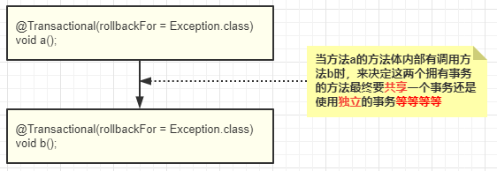

### Spring事务使用篇：论高富帅的重要性

## 前言

* 在上篇[spring aop原理篇：了解spring是如何将切面织入到目标方法 以及aop的执行顺序](1)的文章中，我们熟悉了Spring如何找到切面、如何找到通知、如何生成代理对象以及代理对象的执行顺序。现在，我们再来学习下Spring事务相关的知识点，这篇文章比较简单，适合入门，主要来学习下如何使用Spring的事务以及相关传播机制的特性。

### 一、以测试用例的方式认识Spring的事务机制

* 案例背景：以支付系统的转账业务为例，我们的转账业务一定是一个原子性的操作。A向B转账，A的账户扣钱、B的账户加钱，两者要么一起成功要么一起失败。

#### 1.1 预览测试案例项目结构

* 项目入口Entry.java

  ```java
  public class Entry {
  
      public static void main(String[] args) {
          AnnotationConfigApplicationContext context = new AnnotationConfigApplicationContext(AppConfig.class);
          TransferService transferService = context.getBean(TransferService.class);
          // 调用转账接口，avengerEug向zhangsan转账1元
          transferService.transfer("avengerEug", "zhangsan", new BigDecimal("1"));
      }
  
      @ComponentScan("com.eugene.sumarry.transaction")
      @Configuration
      @EnableTransactionManagement
      @EnableAspectJAutoProxy(exposeProxy = true)
      public static class AppConfig {
  
          @Bean
          public DataSource dataSource() {
              DriverManagerDataSource driverManagerDataSource = new DriverManagerDataSource();
              driverManagerDataSource.setUrl("jdbc:mysql://127.0.0.1:3306/transaction_test?useUnicode=true&characterEncoding=utf-8&useSSL=false&allowMultiQueries=true");
              driverManagerDataSource.setUsername("root");
              driverManagerDataSource.setDriverClassName("com.mysql.jdbc.Driver");
              driverManagerDataSource.setPassword("");
              return driverManagerDataSource;
          }
  
          @Bean
          public PlatformTransactionManager platformTransactionManager(DataSource dataSource) {
              DataSourceTransactionManager manager = new DataSourceTransactionManager();
              manager.setDataSource(dataSource);
              return manager;
          }
  
          @Bean
          public JdbcTemplate jdbcTemplate(DataSource dataSource) {
              JdbcTemplate jdbcTemplate = new JdbcTemplate(dataSource);
              return jdbcTemplate;
          }
  
      }
  }
  ```

* 转账接口Transfer.java

  ```java
  public interface TransferService {
  
      // 转账操作
      void transfer(String outAccountId, String inAccountId, BigDecimal amount);
  
      // 加钱操作
      void incrementAmount(String accountId, BigDecimal amount);
  
  }
  ```

* 转账接口实现类TransferImpl.java

  ```java
  @Component
  public class TransferServiceImpl implements TransferService {
  
      @Autowired
      private JdbcTemplate jdbcTemplate;
  
      @Override
      public void transfer(String outAccountId, String inAccountId, BigDecimal amount) {
          // 进钱
          this.incrementAmount(inAccountId, amount);
  
          // ...... 可以增加各种其他业务逻辑  @extension1
          
          // 出钱
          jdbcTemplate.update("UPDATE account SET amount = amount - ? WHERE id = ?", amount, outAccountId);
          
          // ...... 可以增加各种其他业务逻辑  @extension2
      }
  
      @Override
      public void incrementAmount(String accountId, BigDecimal amount) {
          // 不考虑任何并发情况，直接新增金额
          jdbcTemplate.update("UPDATE account SET amount = amount + ? WHERE id = ?", amount, accountId);
      }
  }
  ```

* 数据库 & 数据库表数据初始化脚本

  ```mysql
  # 创建数据库
  CREATE DATABASE transaction_test;
  
  # 使用数据库
  USE transaction_test;
  
  # 创建表
  CREATE TABLE account(
    id VARCHAR(255) PRIMARY KEY,
    amount Decimal NULL
  );
  
  # 初始化数据
  INSERT INTO account(id, amount) VALUES
  ('avengerEug', 100),
  ('zhangsan', 20);
  ```

  

* 项目结构分析：

  > 首先，在Entry类中定义了一个Spring的配置类**AppConfig**。在这个配置类中，我们指定了spring应用的扫描路径、开启了事务、开启了AOP功能并暴露了代理对象、指定了DataSource、添加了事务管理器以及初始化了JdbcTemplate。
  >
  > 其次，定义了转账接口Transfer.java，以此接口来模拟转账业务。
  >
  > 最后，提供了数据库 & 数据库表数据初始化脚本，方便快速搭建数据库环境。
  
* 

#### 1.2 使用@Transactional注解，为转账接口开启事务功能

* 在上述的案例中，我们的转账接口是不具备事务功能的，如果我在`@extension1`处添加了其他业务逻辑的处理，并且在处理这些业务逻辑的过程中抛了异常。那么会出现数据库**inAccountId的钱增加了，但是outAccountId的钱没有减少的情况**。上面有分析到，转账操作是一个原子性操作。为了达到这个目的，我们可以在转账接口添加@Transactional注解来告诉Spring：我这个转账接口需要开启事务功能，后续的事务开启、事务提交、事务回滚将由spring来完成。

* 改造**TransferServiceImpl.java**类，其代码如下所示：

  ```java
  @Component
  public class TransferServiceImpl implements TransferService {
  
      @Autowired
      private JdbcTemplate jdbcTemplate;
  
      @Transactional(rollbackFor = Exception.class)  // @1
      @Override
      public void transfer(String outAccountId, String inAccountId, BigDecimal amount) {
          // 进钱
          this.incrementAmount(inAccountId, amount);
  
          // ...... 可以增加各种其他业务逻辑  @extension1
          
          // 出钱
          jdbcTemplate.update("UPDATE account SET amount = amount - ? WHERE id = ?", amount, outAccountId);
          
          // ...... 可以增加各种其他业务逻辑  @extension2
      }
  
      @Override
      public void incrementAmount(String accountId, BigDecimal amount) {
          // 不考虑任何并发情况，直接新增金额
          jdbcTemplate.update("UPDATE account SET amount = amount + ? WHERE id = ?", amount, accountId);
      }
  }
  ```

  `@1`处的代码表示：transfer接口是一个原子性接口，Spring在执行transfer接口之前会向MySQL提交一个开启事务的指令。若transfer接口中抛出了Exception类型的异常，Spring会向MySQL发送一个回滚操作的指令，否则发送提交事务的指令。我们可以把执行过程简单的理解成下列所示的伪代码：

  ```java
  try {
      // 开启事务
      begin transaction;
      
      // 执行转账接口
      transfer();
      
      // 提交事务
      commit transaction;
  } catch(Exception ex) {
      // 捕获transfer逻辑执行的异常，执行回滚操作
      rollback transaction;
  }
  ```

* 接下来我们以上述的代码为标准，新增几种测试用例，来认识spring的事务功能。

##### 1.2.1 测试用例1：直接执行Entry.java的main方法

* 在正常情况下，transfer接口内部不会抛出异常，因此转账业务是能执行成功的。测试用例1的执行结果为：**avengerEug的账户往zhangsan的账户转账1块钱  ==> 执行成功**

##### 1.2.1 测试用例2：改造TransferServiceImpl，在@extension1处模拟抛出异常

* 其改动后的代码如下所示：

  ```java
  @Component
  public class TransferServiceImpl implements TransferService {
  
      @Autowired
      private JdbcTemplate jdbcTemplate;
  
      @Transactional(rollbackFor = Exception.class)  // @1
      @Override
      public void transfer(String outAccountId, String inAccountId, BigDecimal amount) {
          // 进钱
          this.incrementAmount(inAccountId, amount);
  
  	    int result = 1 / 0;   // @extension1
          
          // 出钱
          jdbcTemplate.update("UPDATE account SET amount = amount - ? WHERE id = ?", amount, outAccountId);
          
          // ...... 可以增加各种其他业务逻辑  @extension2
      }
  
      @Override
      public void incrementAmount(String accountId, BigDecimal amount) {
          // 不考虑任何并发情况，直接新增金额
          jdbcTemplate.update("UPDATE account SET amount = amount + ? WHERE id = ?", amount, accountId);
      }
  }
  ```

  很明显，在@extension1处会抛出一个**算术异常**，因此测试用例2的执行结果为：**avengerEug向zhangsan转账1元 --> 失败**。

* 熟悉上述的两个测试用例后，相信你已经对spring的事务有所了解了，接下来我们来认识下Spring的事务传播机制。

### 二、认识Spring的事务传播机制

* 这里穿插一个知识点：**Spring的事务传播机制与MySQL的事务隔离机制是两个完全不一样的东西，两者没有因果关系。**简单理解的方式为：**Spring的事务传播机制是在方法调用栈中，如果有多个方法具有事务功能时，来确认它们是使用`同一个事务`还是使用`独立的事务`或者`其他策略`。** 如下图所示：

  
  
* 那Spring有哪些事务传播机制呢？我们查看下**org.springframework.transaction.annotation.Propagation**枚举，在源码中一共定义了7中事务传播机制，我将以**老王和小美相亲的案例**来说明这7种事务传播机制特性。

#### 2.1 REQUIRED

* 如图所示：上游方法若存在事务，则共用一个事务，否则开启一个新事务。保证方法一定是原子性的。

#### 2.2 NOT_SUPPORTED

* 如图所示：给自己贴上一个标签，我不需要事务。

#### 2.3 REQUIRES_NEW

* 如图所示：狂妄自大，我一定有事务，这是一个定理，不会因任何外界因素而改变

#### 2.4 MANDATORY

* 老王已经暗恋心仪的校花小美很久了。这一次，他终于骨气勇气来到了校花的房门口，敲门说：小美，在吗？ 小妹打开门一看，对着老王说：不是高富帅（没有事务）休想打老娘的主意。


