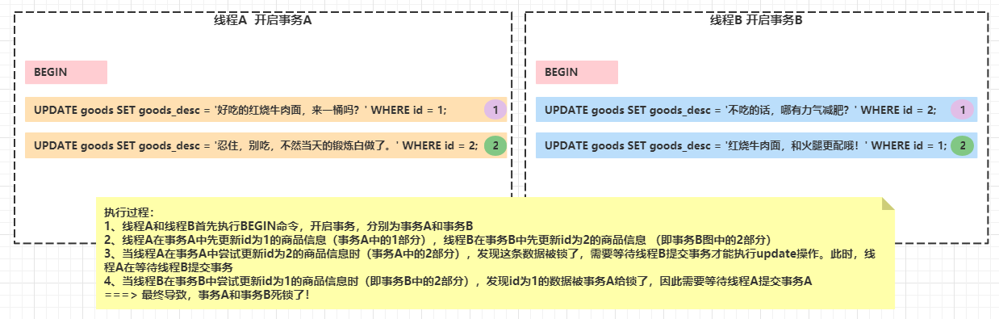

# 我惊呆了！阿里P7面试官问我：有一个事务方法，参数是一个list，内部遍历list循环更新商品信息。这个api会出现死锁吗？

## 前言

* 如标题所示，我们把这个**事务方法**的原型展示出来了，其代码如下所示：

  ```java
  @Transactional
  public void updateGoodsList(List<Goods> goodsList) {
      for (Goods goods : goodsList) {
          goodsDao.updateById(goods);
      }
  }
  ```

  逻辑非常简单，就是循环更新传入的goods，然后根据id更新goods表中对应的行信息，而且还拥有事务功能。但就是这么简单的一个api，被阿里P7面试官直接逼问：**这个方法会出现死锁的情况吗**？（**`读到这里的你，强烈建议先自己思考下`**）

## 一、MySQL出现死锁的原因

* 首先，在回答问题前，我们应该要思考下：**在MySQL的默认可重复读的事务隔离级别中，什么情况下会出现死锁呢**？

* 它需要满足两个条件：

  > 第一：必须有两个事务同时存在
  >
  > 第二：两个事务同时更新两条相同的数据，更新顺序完全相反。

* 为了让大家更好的理解上面两个条件，我们举个例子来说明。假设商品表现在存储的信息是这样的

  | id   | goods_name | goods_desc                   |
  | ---- | ---------- | ---------------------------- |
  | 1    | 红烧牛肉面 | 好吃的红烧牛肉面             |
  | 2    | 薯片       | 吃一包，你当天的锻炼就白做了 |
  | 3    | 荞麦面     | 减肥选它准没错！             |

  然后呢，我现在有两个事务，分别为事务A和事务B。事务A中执行了两条UPDATE SQL，分别是：

  ```sql
  UPDATE goods SET goods_desc = '好吃的红烧牛肉面，来一桶吗？' WHERE id = 1;
  UPDATE goods SET goods_desc = '忍住，别吃，不然当天的锻炼白做了。' WHERE id = 2;
  ```

  事务B中执行两条UPDATE SQL，分别是

  ```sql
  UPDATE goods SET goods_desc = '不吃的话，哪有力气减肥？' WHERE id = 2;
  UPDATE goods SET goods_desc = '红烧牛肉面，和火腿更配哦！' WHERE id = 1;
  ```

  当他们在执行过程中，将会产生死锁，其过程如下图所示：

  

  如果你仔细阅读了上图的话，那么你就会发现上述说的死锁情况的两个条件了：

  第一：必须有两个事务同时存在。这个条件就比较明了了：用上图的案例来说就是事务A和事务B

  第二：两个事务同时更新两条相同的数据，更新顺序完全相反。这个条件也比较明了了：事务A和事务B同时更新id为1和id为2的数据。并且更新顺序完全相反，事务A先更新id为1再更新id为2的数据。而事务B先更新id为2再更新id为1的数据。

## 二、回归问题本质，分析api是否存在死锁问题

* 分析思路：**紧扣发生死锁的两个条件**。

* 我们先来看是否满足第一个条件：执行updateGoodsList方法时，什么情况下会同时出现两个事务？这很简单呀，我们的项目通常同时部署在web容器中的，每次请求容器都会调度一个线程来处理请求。当我们并发请求updateGoodsList方法时，那就会出现多个事务呀。因此，这个条件是满足的。

* 我们再来看第二个条件：什么情况下会出现两个事务同时更新两条相同的数据，然后更新顺序是完全相反的呢？（**此处思考3分钟....**），三分钟过后..... 很简单，我们是遍历list来更新goods表的，更新条件就是商品的id。那假如我们的list中存储的结构就是反的呢？即线程A和线程B请求updateGoodsList方法的参数结构是这样的：

  

  这样，是不是就和我们上述分析的情况一模一样了？因此，这个api是可能出现死锁的情况的。

## 三、总结

* 有些面试官可能不会直接考察你的技术，而是通过实际场景来考察相应的技术，目的是**考验求职者实际解决问题的能力**。
* **如果你觉得我的文章有用的话，欢迎点赞、收藏和关注。:laughing:**
* **I'm a slow walker, but I never walk backwards**