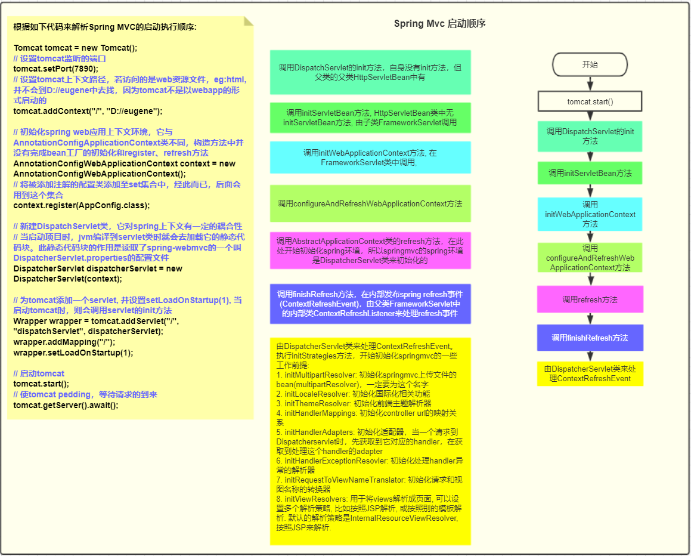

# spring mvc学习模块

## 一、使用servlet3.0特性启动spring mvc项目

* 地址: [https://github.com/AvengerEug/spring/tree/develop/spring-mvc/servlet3dot0spi](https://github.com/AvengerEug/spring/tree/develop/spring-mvc/servlet3dot0spi)

## 二、使用springmvc中自带的上传文件功能

* 地址: [https://github.com/AvengerEug/spring/tree/develop/spring-mvc/upload-file](https://github.com/AvengerEug/spring/tree/develop/spring-mvc/upload-file)

## 三、自定义参数解析器，实现参数注入

* 地址: [https://github.com/AvengerEug/spring/tree/develop/spring-mvc/customer-argument-resolver](https://github.com/AvengerEug/spring/tree/develop/spring-mvc/customer-argument-resolver)

# spring mvc处理请求流程

* 官网提供步骤: [https://docs.spring.io/spring/docs/current/spring-framework-reference/web.html#mvc-servlet-sequence](https://docs.spring.io/spring/docs/current/spring-framework-reference/web.html#mvc-servlet-sequence)
* 因为现在spring web框架的趋势，jsp逐渐被淘汰了，所以将忽略对视图解析器的配置

## 一、解析

* 官网中的解释大概就是: 

  ```
  将所有的组件: HanderMapping, HandlerAdapter, MultipartResolver等组件绑定到web应用程序上下文中。每一个请求过来时，拿到对应的handler，再根据handler拿到处理它的handlerAdapter，最终处理它。再根据返回结果来判断是返回视图还是json数据。当然内部可能还会存在很多操作，比如过滤器、拦截器等等。后面，将会仔细总结mvc一个请求过来的完整处理。
  ```

## 二、启动流程图
* 在spring容器初始化完成后，监听ApplicationContextRefresh事件，此监听器org.springframework.web.servlet.FrameworkServlet对spring的事件做了监听，如果是ContextRefreshedEvent事件的话，将执行Dispatcher容器的refresh方法（在这里初始化url与mapping的映射）


## 三、执行请求流程图


